<!-- حافظ على هوية المطوّر ورابط المستودع والأوامر والمسارات وأرقام الإصدارات
     وعناوين المحافظ في هذا الملف مطابقة بايتًا ببايت لملفات README المترجمة. -->

<p align="center">
  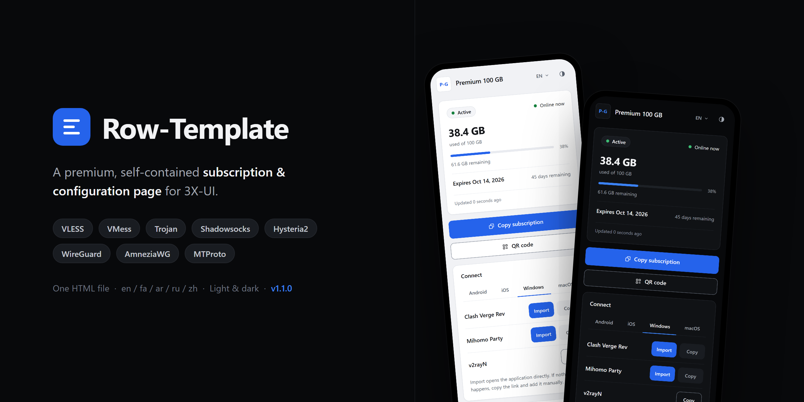
</p>

<p align="center">
  صفحة اشتراك مصقولة ومكتفية ذاتيًا للوحات <a href="https://github.com/MHSanaei/3x-ui">3X-UI</a> — خمسة عشر تصميمًا، كلٌّ منها ملف HTML واحد، قابلة لإعادة التسمية بالكامل (white-label)، ودون أي طلبات إلى أطراف ثالثة من الصفحة التي يفتحها مشتركوك.
</p>

<p align="center">
  <a href="README.md">English</a> | <a href="README.fa.md">فارسی</a> | <strong>العربية</strong> | <a href="README.ru.md">Русский</a> | <a href="README.zh-CN.md">简体中文</a>
</p>

<p align="center">
  <a href="LICENSE"></a>
  <a href="https://github.com/iitzSeriZdev/Row-Template/releases/latest"></a>
  
  
  <a href="https://iitzseridev.github.io/Row-Template/"></a>
</p>

<p align="center">
  <a href="#التثبيت">التثبيت</a> ·
  <a href="#التصاميم">التصاميم</a> ·
  <a href="https://iitzseridev.github.io/Row-Template/ar/">التوثيق</a> ·
  <a href="CHANGELOG.md">سجل التغييرات</a> ·
  <a href="https://github.com/iitzSeriZdev/Row-Template/releases">الإصدارات</a>
</p>

---

## ما هو Row-Template؟

يستطيع 3X-UI أن يعرض على المشتركين صفحة مخصّصة بدلًا من صفحته المدمجة. وRow-Template هو تلك الصفحة: يفتح المشترك رابط اشتراكه فيرى باقته واستهلاكه وتاريخ انتهاء اشتراكه، مع طرق لإضافة الاشتراك بلمسة واحدة إلى التطبيق الذي يستخدمه.

يُقدَّم كل تصميم في ملف HTML واحد مكتفٍ ذاتيًا، تُضمَّن فيه جميع الأنماط والسكربتات والخطوط ومولّد رمز QR. يثبّته أمر واحد بجوار لوحتك، ويوجّه اللوحة إليه، ويمنحك المدير `row-template` لإدارة العلامة التجارية والتحديثات والتراجع.

## لماذا Row-Template؟

- **الخصوصية في صميم التصميم.** الصفحة التي يفتحها مشتركوك لا ترسل أي طلبات إلى أطراف ثالثة. تُولَّد رموز QR داخل الصفحة نفسها، وتُحقن علامتك التجارية كنص — لا تُنفَّذ أبدًا ولا تُرسل إلى أي مكان.
- **إعادة تسمية حقيقية بالكامل.** اسم خدمتك، ورابط الدعم الخاص بك، وشعارك. لا شيء في الصفحة المعروضة يشير إلى Row-Template.
- **خمسة عشر تصميمًا، كلٌّ في ملف واحد.** اختر المظهر الذي يناسب خدمتك. جميع التصاميم تتشارك المزايا واللغات وفحوص الأمان نفسها.
- **مصمَّم لمشتركيك.** عرض حيّ للاستهلاك وتاريخ الانتهاء، واستيراد بلمسة واحدة إلى التطبيقات الشائعة، وقائمة قابلة للبحث بالإعدادات الفردية لإضافة خادم واحد يدويًا.
- **آمن في التشغيل.** إصدارات يُتحقَّق من مجموعها الاختباري، وتفعيل ذرّي، وتراجع بأمر واحد. لا يعدّل 3X-UI أبدًا: الإعداد الوحيد الذي يغيّره في اللوحة هو مجلد صفحة الاشتراك (`subThemeDir`).

## التصاميم

يأتي Row-Template 1.2.0 بخمسة عشر تصميمًا، والتصميم الافتراضي هو Row.

<table>
  <tr>
    <td align="center">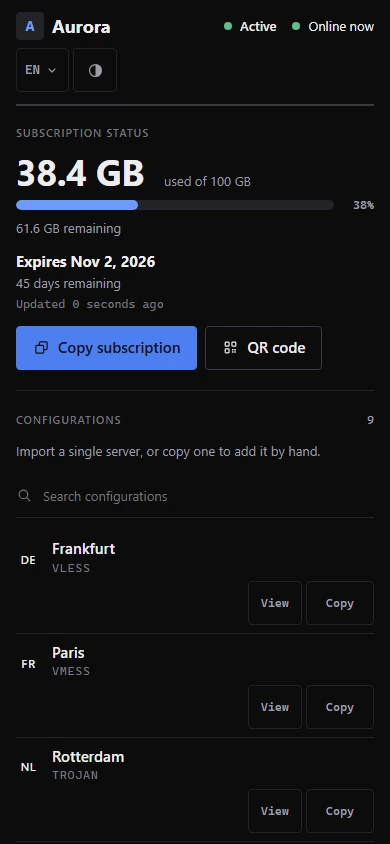<br><sub>Row</sub></td>
    <td align="center">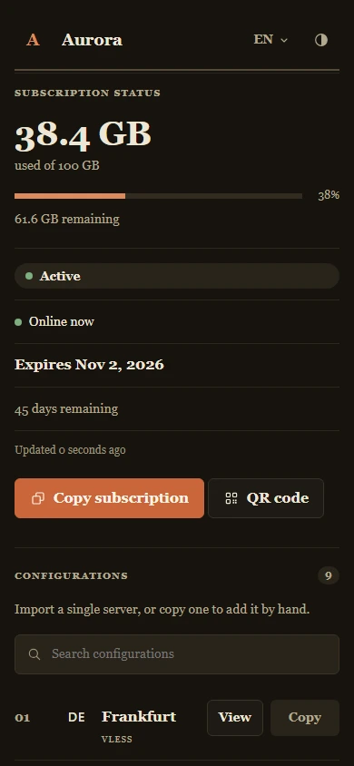<br><sub>Editorial</sub></td>
    <td align="center">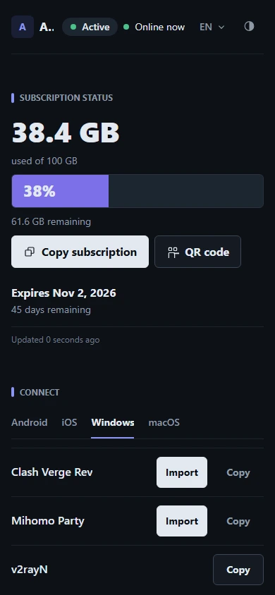<br><sub>Canvas</sub></td>
    <td align="center">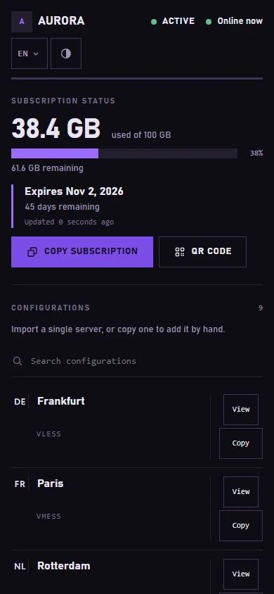<br><sub>Prism</sub></td>
    <td align="center">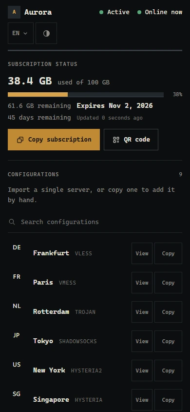<br><sub>Terminal</sub></td>
  </tr>
  <tr>
    <td align="center">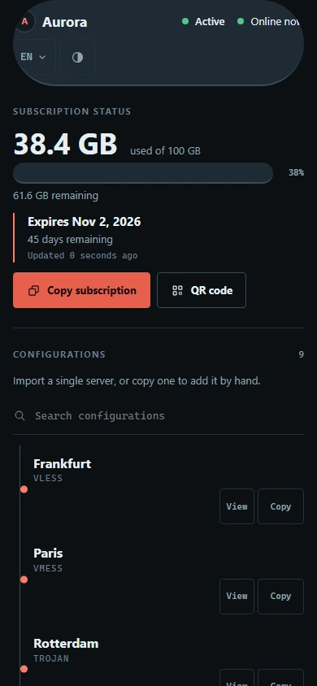<br><sub>Pulse</sub></td>
    <td align="center">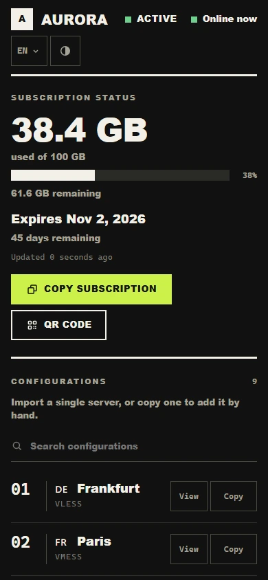<br><sub>Brutal</sub></td>
    <td align="center">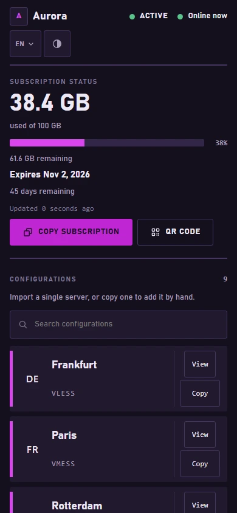<br><sub>Arcade</sub></td>
    <td align="center">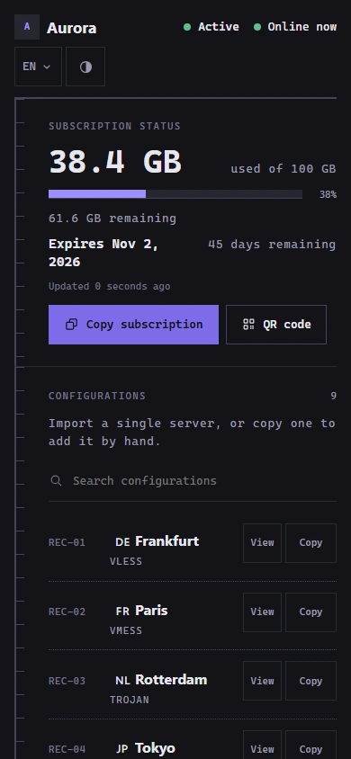<br><sub>Sketch</sub></td>
    <td align="center">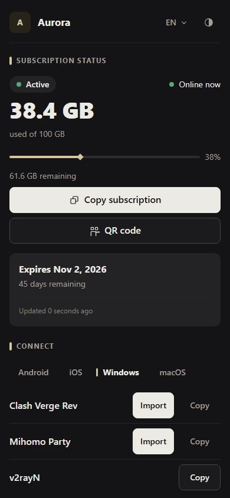<br><sub>Signature</sub></td>
  </tr>
  <tr>
    <td align="center">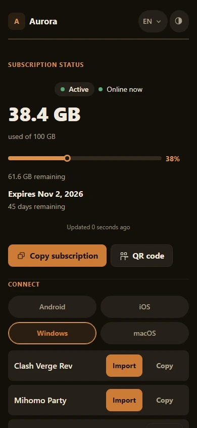<br><sub>Saffron</sub></td>
    <td align="center">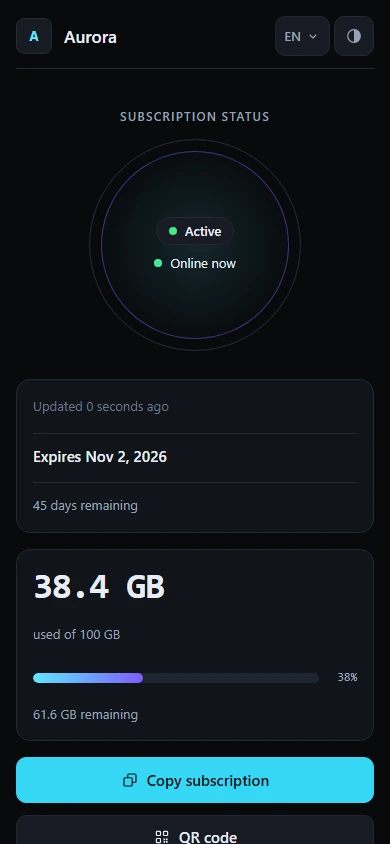<br><sub>Pulse Nova</sub></td>
    <td align="center">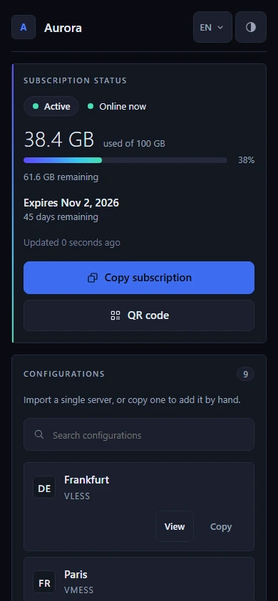<br><sub>Prism Nova</sub></td>
    <td align="center">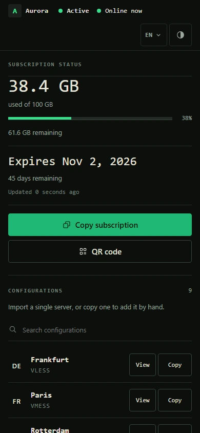<br><sub>Terminal Nova</sub></td>
    <td align="center">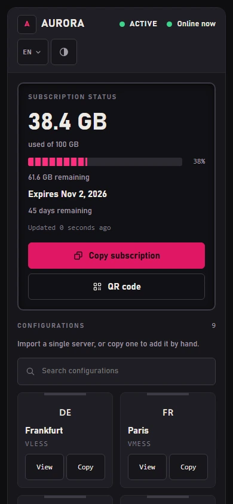<br><sub>Arcade Nova</sub></td>
  </tr>
</table>

<sub>المعاينات مولَّدة من بيانات المشروع النموذجية. معاينات سطح المكتب والهاتف لكل تصميم موجودة في <a href="https://iitzseridev.github.io/Row-Template/ar/templates/">معرض القوالب</a>.</sub>

اختر التصميم أثناء تثبيت تفاعلي جديد، أو اضبط `RT_TEMPLATE` للتثبيت عبر سكربت، أو غيّره لاحقًا من المدير (**Reconfigure branding → Template**). تحتفظ التحديثات باختيارك.

## المزايا

**لمشتركيك**

- **حالة حيّة.** حالة الباقة، والبيانات المستهلكة والمتبقية، وتاريخ الانتهاء، تُحدَّث من لوحتك طالما كانت الصفحة ظاهرة.
- **استيراد بلمسة واحدة** إلى التطبيقات الشائعة، مرتّبة حسب المنصة: v2rayNG وHapp وsing-box على Android؛ وStreisand وV2Box وShadowrocket على iOS؛ وClash Verge Rev وMihomo Party وv2rayN على Windows؛ وClash Verge Rev وStreisand وV2Box على macOS.
- **النسخ ورمز QR.** انسخ رابط الاشتراك أو امسحه كرمز QR يُولَّد داخل الصفحة.
- **مستكشف الإعدادات.** كل خادم في صف خاص به، مع علم الدولة أو شارة بالأحرف الأولى (monogram) ووسم البروتوكول (VLESS وVMess وTrojan وShadowsocks وHysteria/Hysteria2 وWireGuard وAmneziaWG وTelegram MTProto)، مع رمز QR ونسخ لكل إعداد، وبحث في القوائم الطويلة.
- **خمس لغات** — الإنجليزية والفارسية والعربية والروسية والصينية — مع تخطيط من اليمين إلى اليسار، واختيار المظهر System / Light / Dark.

**لك**

- **علامة تجارية قابلة لإعادة التسمية.** اسم الخدمة ورابط الدعم والشعار، وكلها اختيارية، تُخزَّن كبيانات وتُحقن كنص.
- **مدير لكل شيء.** قائمة تفاعلية وأوامر مباشرة للعلامة التجارية والتحديثات والتحقق والتراجع وإلغاء التثبيت.
- **تحديثات من القناة المستقرة.** لا يثبّت `row-template update` إصدارًا مستقرًا أحدث إلا إذا وُجد.

**الخصوصية والأمان**

- **لا طلبات إلى أطراف ثالثة** من الصفحة المعروضة: لا شبكات CDN، ولا خدمات خارجية لرموز QR أو تحديد الموقع، ولا قياس عن بُعد (telemetry). تأتي الحالة الحيّة من لوحتك أنت.
- **تحقق SHA-256 إلزامي** لكل تنزيل لإصدار، دون أي خيار لتجاوزه.
- **تفعيل ذرّي.** تُولَّد الصفحة الجديدة ويُتحقَّق منها قبل أن تحل محل الصفحة الحالية، فلا تترك خطوة فاشلة صفحة معطوبة قيد العمل.
- **كشف حذر للوحة.** إذا لم تكن قاعدة بيانات اللوحة التي يعثر عليها Row-Template قاعدة بيانات SQLite صالحة، فإنه يرفض استخدامها بدلًا من تخمين قاعدة بيانات أخرى.

## اللوحات المدعومة

| اللوحة | الحالة | ملاحظات |
| ----- | ------ | ----- |
| [3X-UI](https://github.com/MHSanaei/3x-ui) (MHSanaei) | ✅ مدعومة | تتطلب الإصدار **>= 3.6.0** |
| [PasarGuard](https://github.com/PasarGuard/panel) | 🔬 قيد البحث | غير مدعومة؛ لا يوجد مسار تثبيت |
| [Rebecca](https://github.com/rebeccapanel/Rebecca) | 🔬 قيد البحث | غير مدعومة؛ لا يوجد مسار تثبيت |

3X-UI هي اللوحة الوحيدة المدعومة. تستخدم PasarGuard وRebecca محرّكَي قوالب مختلفين (Jinja2 وpongo2)؛ يُبنى هيكل صفحة كل تصميم لهما ويُحزَم في الإصدار لأغراض الدراسة، لكن المثبّت لا يضعه في مكانه ولا توجد تعليمات تثبيت لهما. راجع [التوافق](https://iitzseridev.github.io/Row-Template/ar/compatibility/) للاطلاع على نتائج البحث.

## البنية

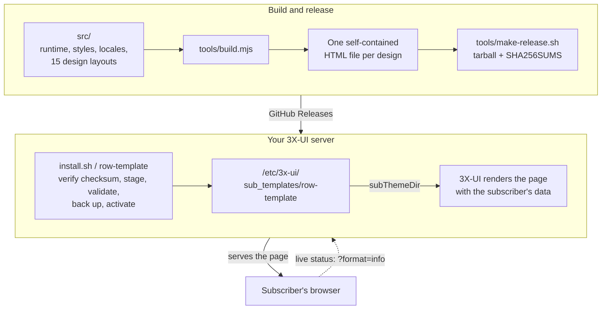

- **ملف واحد لكل تصميم.** يضمّن `tools/build.mjs` الشيفرة المشتركة والترجمات والخطوط ومولّد QR داخل تخطيط كل تصميم، ويرفض أي تخطيط ينقصه أيٌّ من نقاط الربط (hooks) التي تحتاجها الشيفرة. ثم يرفض `tools/verify.mjs` أي ملف يحمّل شيئًا من مصدر بعيد أو يحتوي على بنية محظورة.
- **اللوحة هي من تعرض الصفحة.** الصفحة قالب: يملأ 3X-UI بيانات المشترك فيها عند تقديمها، ثم تحدّث الصفحة حالتها من اللوحة نفسها.
- **لا يعدّل المثبّت 3X-UI أبدًا.** يكتب في مجلده الخاص ويغيّر إعدادًا واحدًا في اللوحة، هو `subThemeDir`، ليشير إليه.

| المسار | المحتوى |
| ---- | ---------------- |
| `src/` | شيفرة الصفحة وأنماطها وترجماتها؛ كل تصميم في `src/templates/<id>/` |
| `template/index.html` | صفحة Row المبنية، وهي مُضمَّنة في المستودع |
| `tools/` | البناء والتحقق والإصدار وعارض الـ fixtures المكتوب بـ Go |
| `installer/` | `install.sh` والأمر `row-template` ومكتبته الإدارية |
| `tests/` | مجموعات الاختبارات |
| `docs/` | موقع التوثيق؛ سجلات التصميم في [`docs/design/`](docs/design/README.md) |

## التثبيت

> **نظام التشغيل المُوصى به: Ubuntu 24.04 LTS (x86_64).** قد تعمل توزيعات Linux الحديثة الأخرى لكنها لم تحظَ بالمستوى نفسه من تغطية التحقق.

**المتطلبات:** خادم يشغّل 3X-UI **>= 3.6.0**، وصلاحية root عليه، و`curl` و`tar` و`sha256sum` (متوفرة على جميع أنظمة Linux تقريبًا). ويحتاج التفعيل التلقائي أيضًا إلى `sqlite3`.

شغّل الأمر بصلاحية **root** على الخادم الذي يستضيف لوحة 3X-UI:

```bash
bash <(curl -fsSL https://github.com/iitzSeriZdev/Row-Template/releases/latest/download/install.sh)
```

يقوم المثبّت بما يلي:

1. ينزّل أحدث إصدار مستقر من GitHub.
2. يتحقق من مجموعه الاختباري SHA-256 (إلزامي — دون إمكانية التجاوز).
3. يستخرجه بأمان ويثبّته في `/etc/3x-ui/sub_templates/row-template`.
4. في التثبيت الجديد، يعرض أداة اختيار التصميم (يُبقي Enter على Row).
5. يطلب بيانات علامتك التجارية (اسم الخدمة، رابط الدعم، الشعار — وكلها اختيارية).
6. يولّد الصفحة ويتحقق منها، ثم يفعّلها في اللوحة حيثما أمكن.

لاختيار تصميم دون أداة الاختيار، في سكربت مثلًا:

```bash
RT_TEMPLATE=editorial bash <(curl -fsSL https://github.com/iitzSeriZdev/Row-Template/releases/latest/download/install.sh)
```

إن كنت تفضّل عدم تمرير السكربت مباشرة من الشبكة، فنزّل ملفات الإصدار من [صفحة الإصدارات](https://github.com/iitzSeriZdev/Row-Template/releases/latest)، وتحقق من المجموع الاختباري بنفسك كما يشرح [PROVENANCE.md](PROVENANCE.md)، ثم شغّل `install.sh` المرفق من المجلد المستخرج.

### التفعيل

يُثبَّت Row-Template في مجلد تقدّمه اللوحة كصفحة اشتراك:

```
/etc/3x-ui/sub_templates/row-template
```

- **تلقائيًا:** عند توفر `sqlite3`، يضبطه Row-Template نيابةً عنك. يوقف خدمة اللوحة لفترة وجيزة، ويكتب الإعداد، ثم يشغّل الخدمة من جديد ويتحقق من القيمة. في التثبيت التفاعلي يعرض الإعداد الحالي ويسألك أولًا.
- **يدويًا:** خلاف ذلك، افتح **Panel Settings → Subscription → Profile → Sub Theme Directory** وأدخل القيمة التالية حرفيًا:

  ```
  /etc/3x-ui/sub_templates/row-template
  ```

## الاستخدام

شغّل المدير دون أي وسائط في الطرفية لفتح القائمة التفاعلية:

```bash
row-template
```

أو استخدم أمرًا مباشرة:

| الأمر | وظيفته |
| ------- | ------------ |
| `row-template config` | تغيير اسم الخدمة أو رابط الدعم أو الشعار، ثم إعادة توليد الصفحة |
| `row-template update` | تنزيل إصدار مستقر أحدث والتحقق منه وتفعيله (التحقق من المجموع الاختباري إلزامي) |
| `row-template rollback` | استعادة إصدار سابق (`--auto` أو `--to <backup>`) |
| `row-template verify` | فحص التثبيت وربط اللوحة والصفحة الحالية (وبصلاحيات root يعيد أيضًا التصاميم المفقودة أو الموضوعة في غير مكانها) |
| `row-template version` | عرض الإصدار المثبّت والحد الأدنى المدعوم وإصدار 3X-UI المكتشف |
| `row-template uninstall` | إزالة Row-Template وإعادة اللوحة إلى صفحتها المدمجة |
| `row-template help` | عرض طريقة الاستخدام |

يجب تشغيل الأوامر التي تغيّر النظام (`config` و`update` و`rollback` و`uninstall`) بصلاحية root.

- **العلامة التجارية** تُخزَّن كبيانات، ولا تُنفَّذ أبدًا، وتُحقن في الصفحة كنص. اترك أي حقل فارغًا للحصول على صفحة بلا علامة تجارية. لا يقبل رابط الدعم إلا البروتوكولات التي ينبغي للمتصفح فتحها، مثل `https://…` أو `tg://…` أو `mailto:…`.
- **التحديثات** تتحقق من قناة الإصدارات المستقرة العامة ولا تغيّر شيئًا ما لم يوجد إصدار مستقر أحدث. إذا تعذّر الوصول إلى مصدر الإصدارات، يُبلغ `update` بأنه لم يتمكن من التحقق؛ ولا يُعامَل تثبيتك أبدًا على أنه تالف.
- **التحديث من 1.1.0** يكفيه تشغيل `row-template update` مرة واحدة. ينسخ مُحدِّث 1.1.0 نفسه جزءًا فقط من الإصدار الجديد، لذا فإن التشغيل التالي لـ`row-template` أو `row-template config` أو `row-template verify` بصلاحيات root ينزّل أولًا بقية الإصدار نفسه — كل التصاميم، مع التحقق من checksum.
- **التراجع** يستعيد إصدارًا سابقًا من نسخة احتياطية جرى التحقق منها. تُلتقط لقطة (snapshot) للإصدار الحالي أولًا، بحيث يمكن التعافي من تراجع فاشل، وتُحفَظ علامتك التجارية.
- **إلغاء التثبيت** يزيل ملفات Row-Template. ولا يمسح `subThemeDir` في اللوحة إلا إذا كان يشير إلى Row-Template، فتعود اللوحة إلى صفحتها المدمجة؛ ولا يمسّ الواردات (inbounds) أو العملاء أو الشهادات.

يغطي [التوثيق](https://iitzseridev.github.io/Row-Template/ar/) الإعداد والعلامة التجارية واستكشاف الأخطاء بمزيد من التفصيل.

## التطوير

تُبنى الصفحات من مصادر مقروءة في `src/`. تحتاج إلى Node.js 22 أو أحدث، وإلى Go 1.22 أو أحدث لتشغيل الاختبارات.

```bash
npm run build          # regenerate template/index.html from src/
npm run verify         # check the built page against the safety gates
npm test               # render the fixture pages, then run every test suite
npm run fixtures:all   # render every design's fixture pages on their own
npm run lint:sh        # ShellCheck every shell script
npm run preview        # preview the fixture pages at http://127.0.0.1:8787
```

عملية البناء حتمية (deterministic) — المصادر نفسها تُنتج دائمًا ملف `template/index.html` مطابقًا بايتًا ببايت. موقع التوثيق مساحة عمل منفصلة في `docs/`؛ راجع [docs/README.md](docs/README.md).

## الاختبار

- **`npm test`** يولّد أولًا صفحات الـ fixtures لكل التصاميم باستخدام العارض المكتوب بـ Go، ثم يشغّل مجموعات الاختبارات: سكربتات الصفحة، والبناء، والملف النهائي لكل تصميم، وحمولة الإصدار، والمثبّت — الذي تُشغَّل مكتبته الـ shell المنشورة في `bash` حقيقي على fixtures مؤقتة.
- **`npm run verify`** يفحص صفحة مبنية وفق بوابات الأمان الخاصة بها، ومنها: مستند كامل، واستبدال كل علامات البناء، وتضمين كل شيء، وعدم وجود مراجع بعيدة، وعدم وجود بُنى محظورة، وسلامة الترجمات، وخلوّ المصادر من المحارف غير المرئية.
- **`npm run lint:sh`** يفشل عند أي خطأ من ShellCheck؛ ويعرض `npm run lint:sh -- -S warning` التقرير الكامل.
- **سير عمل Docs** يبني موقع التوثيق في كل طلب دمج (pull request) يغيّره.

## خارطة الطريق

توجّه، لا وعود:

- **Row-Template 1.2.0** — التصاميم الخمسة عشر وأداة اختيار التصميم الموصوفة أعلاه.
- **PasarGuard وRebecca** — قيد البحث. هيكل الصفحة مبنيّ لكليهما؛ وتحتاج الحالة الحيّة إلى تغيير صغير في الشيفرة أو إلى وكيل عكسي (reverse proxy)، وقد أُرجئ هذا القرار. راجع [التوافق](https://iitzseridev.github.io/Row-Template/ar/compatibility/).
- **التثبيت على أكثر من لوحة** — البنية التحتية للمثبّت (واجهة للوحات، ومحرّك معاملات، ومحوّل لـ 3X-UI، وصيغة نسخ احتياطي جديدة) موجودة، لكن لا يستخدمها أي أمر بعد.
- **القوالب المخصّصة** — مقترح لإضافة تصميمك الخاص: [`docs/design/CUSTOM-TEMPLATES-PROPOSAL.md`](docs/design/CUSTOM-TEMPLATES-PROPOSAL.md).

## المساهمة

نرحّب كثيرًا بتقارير الأخطاء والترجمات وتصحيحات التوثيق. اقرأ [CONTRIBUTING.md](CONTRIBUTING.md) قبل فتح طلب دمج، والتزم بـ[مدونة السلوك](CODE_OF_CONDUCT.md).

**الإبلاغ عن الأخطاء:** افتح تذكرة (issue) على <https://github.com/iitzSeriZdev/Row-Template/issues>. أدرِج إصدار Row-Template لديك (`row-template version`)، وإصدار 3X-UI، ونظام التشغيل وإصداره، ومعمارية المعالج، ومخرجات `row-template verify`، وخطوات واضحة لإعادة إنتاج المشكلة.

> **لا تُدرِج أي أسرار.** لا تلصق إطلاقًا روابط الاشتراك، أو قيم `subId`، أو معرّفات UUID الخاصة بالعملاء، أو أسماء مستخدمي اللوحة أو كلمات مرورها، أو ملفات تعريف الارتباط (cookies)، أو الرموز (tokens)، أو `webBasePath` الخاص باللوحة، أو مفاتيح TLS، أو عناوين الخوادم الحقيقية. ونقِّح السجلات قبل مشاركتها.

## الأمان

هل اكتشفت ثغرة؟ يُرجى الإبلاغ عنها بشكل خاص — راجع [SECURITY.md](SECURITY.md). لا تفتح تذكرة عامة للمشكلات الأمنية. ويشرح [PROVENANCE.md](PROVENANCE.md) كيف تُبنى الإصدارات وكيف يمكن التحقق منها.

## ادعم المشروع

Row-Template مجاني ومفتوح المصدر. إن وفّر عليك وقتًا، يمكنك دعم تطويره:

- **USDT (BEP20 / BNB Smart Chain):**

  ```
  0x2606551375987cec71F5fC033968B638A7a4bae4
  ```

- **TRON:**

  ```
  TYD5RFfiYrcETzWNSkAhfwgmRu1wQBbs6W
  ```

- **NOWPayments:** <https://nowpayments.io/donation/iitzSeriZ>

شكرًا لك.

## الترخيص

مُرخَّص بموجب [رخصة MIT](LICENSE). ومولّد رمز QR المرفق (`src/vendor/uqr`) مُضمَّن بموجب رخصة MIT الخاصة به، والجزء المضمَّن من خط Vazirmatn بموجب رخصة SIL Open Font License (`src/fonts/OFL.txt`).

## المطوّر

طوّره ويصونه **iitzSeriZdev** — <https://github.com/iitzSeriZdev/Row-Template>
