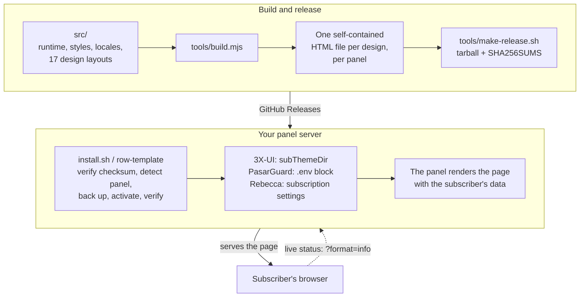

<!-- حافظ على هوية المطوّر ورابط المستودع والأوامر والمسارات وأرقام الإصدارات
     وعناوين المحافظ في هذا الملف مطابقة بايتًا ببايت لملفات README المترجمة. -->

<p align="center">
  
</p>

<p align="center">
  صفحة اشتراك مصقولة ومكتفية ذاتيًا للوحات <a href="https://github.com/MHSanaei/3x-ui">3X-UI</a> و<a href="https://github.com/PasarGuard/panel">PasarGuard</a> و<a href="https://github.com/rebeccapanel/Rebecca">Rebecca</a> — سبعة عشر تصميمًا، كلٌّ منها ملف HTML واحد، قابلة لإعادة التسمية بالكامل (white-label)، ودون أي طلبات إلى أطراف ثالثة من الصفحة التي يفتحها مشتركوك.
</p>

<p align="center">
  <a href="README.md">English</a> | <a href="README.fa.md">فارسی</a> | <strong>العربية</strong> | <a href="README.ru.md">Русский</a> | <a href="README.zh-CN.md">简体中文</a>
</p>

<p align="center">
  <a href="LICENSE"></a>
  <a href="https://github.com/iitzSeriZdev/Row-Template/releases/latest"></a>
  
  
  <a href="https://iitzseridev.github.io/Row-Template/"></a>
</p>

<p align="center">
  <a href="#التثبيت">التثبيت</a> ·
  <a href="#التصاميم">التصاميم</a> ·
  <a href="https://iitzseridev.github.io/Row-Template/ar/">التوثيق</a> ·
  <a href="CHANGELOG.md">سجل التغييرات</a> ·
  <a href="https://github.com/iitzSeriZdev/Row-Template/releases">الإصدارات</a>
</p>

---

## ما هو Row-Template؟

تستطيع كلٌّ من 3X-UI وPasarGuard وRebecca أن تعرض على المشتركين صفحة مخصّصة بدلًا من صفحتها المدمجة. وRow-Template هو تلك الصفحة: يفتح المشترك رابط اشتراكه فيرى باقته واستهلاكه وتاريخ انتهاء اشتراكه، مع طرق لإضافة الاشتراك بلمسة واحدة إلى التطبيق الذي يستخدمه.

يُقدَّم كل تصميم في ملف HTML واحد مكتفٍ ذاتيًا، تُضمَّن فيه جميع الأنماط والسكربتات والخطوط ومولّد رمز QR، ومعه نسخة من كل تصميم بلغة قوالب كل لوحة. يكتشف أمر واحد لوحتك، ويثبّت الصفحة بجوارها، ويوجّه اللوحة إليها، ويمنحك المدير `row-template` لإدارة العلامة التجارية والتحديثات والتراجع.

## لماذا Row-Template؟

- **الخصوصية في صميم التصميم.** الصفحة التي يفتحها مشتركوك لا ترسل أي طلبات إلى أطراف ثالثة. تُولَّد رموز QR داخل الصفحة نفسها، وتُحقن علامتك التجارية كنص — لا تُنفَّذ أبدًا ولا تُرسل إلى أي مكان.
- **إعادة تسمية حقيقية بالكامل.** اسم خدمتك، ورابط الدعم الخاص بك، وشعارك. لا شيء في الصفحة المعروضة يشير إلى Row-Template.
- **سبعة عشر تصميمًا، كلٌّ في ملف واحد.** اختر المظهر الذي يناسب خدمتك. جميع التصاميم تتشارك المزايا واللغات وفحوص الأمان نفسها — على كل لوحة مدعومة.
- **مصمَّم لمشتركيك.** عرض حيّ للاستهلاك وتاريخ الانتهاء، واستيراد بلمسة واحدة إلى التطبيقات الشائعة، وقائمة قابلة للبحث بالإعدادات الفردية لإضافة خادم واحد يدويًا.
- **آمن في التشغيل.** إصدارات يُتحقَّق من مجموعها الاختباري، وتفعيل على هيئة معاملة يعيد اللوحة إلى حالتها بدقة إن فشلت أي خطوة، وتراجع بأمر واحد. لا يعدّل لوحتك أبدًا: في 3X-UI يغيّر إعدادًا واحدًا (`subThemeDir`)، وفي PasarGuard يضيف كتلة معلَّمة واحدة إلى `.env`، وفي Rebecca يضبط حقلين من إعدادات الاشتراك.

## التصاميم

يأتي Row-Template 1.3.0 بسبعة عشر تصميمًا، والتصميم الافتراضي هو Row.

<table>
  <tr>
    <td align="center"><br><sub>Row</sub></td>
    <td align="center"><br><sub>Editorial</sub></td>
    <td align="center"><br><sub>Canvas</sub></td>
    <td align="center"><br><sub>Prism</sub></td>
    <td align="center"><br><sub>Terminal</sub></td>
  </tr>
  <tr>
    <td align="center"><br><sub>Pulse</sub></td>
    <td align="center"><br><sub>Brutal</sub></td>
    <td align="center"><br><sub>Arcade</sub></td>
    <td align="center"><br><sub>Sketch</sub></td>
    <td align="center"><br><sub>Signature</sub></td>
  </tr>
  <tr>
    <td align="center"><br><sub>Saffron</sub></td>
    <td align="center"><br><sub>Pulse Nova</sub></td>
    <td align="center"><br><sub>Prism Nova</sub></td>
    <td align="center"><br><sub>Terminal Nova</sub></td>
    <td align="center"><br><sub>Arcade Nova</sub></td>
  </tr>
  <tr>
    <td align="center"><br><sub>Meter</sub></td>
    <td align="center"><br><sub>Notebook</sub></td>
  </tr>
</table>

<sub>المعاينات مولَّدة من بيانات المشروع النموذجية. معاينات سطح المكتب والهاتف لكل تصميم موجودة في <a href="https://iitzseridev.github.io/Row-Template/ar/templates/">معرض القوالب</a>.</sub>

اختر التصميم أثناء تثبيت تفاعلي جديد، أو اضبط `RT_TEMPLATE` للتثبيت عبر سكربت، أو غيّره لاحقًا من المدير (**Reconfigure branding → Template**). تحتفظ التحديثات باختيارك.

## المزايا

**لمشتركيك**

- **حالة حيّة.** حالة الباقة، والبيانات المستهلكة والمتبقية، وتاريخ الانتهاء، تُحدَّث من لوحتك طالما كانت الصفحة ظاهرة (في 3X-UI؛ أما في PasarGuard وRebecca فتعرض الصفحة القيم لحظة فتحها).
- **استيراد بلمسة واحدة** إلى التطبيقات الشائعة، مرتّبة حسب المنصة: v2rayNG وHapp وsing-box على Android؛ وStreisand وV2Box وShadowrocket على iOS؛ وClash Verge Rev وMihomo Party وv2rayN على Windows؛ وClash Verge Rev وStreisand وV2Box على macOS.
- **النسخ ورمز QR.** انسخ رابط الاشتراك أو امسحه كرمز QR يُولَّد داخل الصفحة.
- **مستكشف الإعدادات.** كل خادم في صف خاص به، مع علم الدولة أو شارة بالأحرف الأولى (monogram) ووسم البروتوكول (VLESS وVMess وTrojan وShadowsocks وHysteria/Hysteria2 وWireGuard وAmneziaWG وTelegram MTProto)، مع رمز QR ونسخ لكل إعداد، وبحث في القوائم الطويلة.
- **خمس لغات** — الإنجليزية والفارسية والعربية والروسية والصينية — مع تخطيط من اليمين إلى اليسار، واختيار المظهر System / Light / Dark.

**لك**

- **علامة تجارية قابلة لإعادة التسمية.** اسم الخدمة ورابط الدعم والشعار، وكلها اختيارية، تُخزَّن كبيانات وتُحقن كنص.
- **مدير لكل شيء.** قائمة تفاعلية وأوامر مباشرة للعلامة التجارية والتحديثات والتحقق والتراجع وإلغاء التثبيت.
- **تحديثات من القناة المستقرة.** يثبّت `row-template update` أحدث إصدار مستقر بعد التحقق منه في كل مرة تشغّله فيها — ما يجعله أيضًا وسيلة سريعة للإصلاح.

**الخصوصية والأمان**

- **لا طلبات إلى أطراف ثالثة** من الصفحة المعروضة: لا شبكات CDN، ولا خدمات خارجية لرموز QR أو تحديد الموقع، ولا قياس عن بُعد (telemetry). تأتي الحالة الحيّة من لوحتك أنت.
- **تحقق SHA-256 إلزامي** لكل تنزيل لإصدار، دون أي خيار لتجاوزه.
- **تفعيل ذرّي.** تُولَّد الصفحة الجديدة ويُتحقَّق منها قبل أن تحل محل الصفحة الحالية، فلا تترك خطوة فاشلة صفحة معطوبة قيد العمل.
- **كشف حذر للوحة.** لا تُعدّ اللوحة مثبّتة إلا حين تتفق إشارات مستقلة؛ واللوحة المثبّتة جزئيًا، أو قاعدة بيانات اللوحة التي ليست قاعدة بيانات SQLite صالحة، تُرفض بدلًا من التخمين.

## اللوحات المدعومة

| اللوحة | الحالة | ملاحظات |
| ----- | ------ | ----- |
| [3X-UI](https://github.com/MHSanaei/3x-ui) (MHSanaei) | ✅ مدعومة | تتطلب الإصدار **>= 3.6.0** |
| [PasarGuard](https://github.com/PasarGuard/panel) | ✅ مدعومة منذ 1.3.0 | التثبيت الرسمي عبر Docker أو التثبيت من المصدر (`pasarguard.service`) |
| [Rebecca](https://github.com/rebeccapanel/Rebecca) | ✅ مدعومة منذ 1.3.0 | تفعيل تلقائي مع SQLite و`sqlite3`؛ ومع MySQL/MariaDB إعداد واحد يُدخَل في لوحة التحكم |

تستخدم اللوحات الثلاث ثلاثة محرّكات قوالب مختلفة — `html/template` في Go وJinja2 وpongo2 — لذا يُبنى كل تصميم مرة لكل لوحة، ويُختبر كل إصدار منه بعرضه بمحرّك تلك اللوحة الحقيقي. يكتشف المثبّت اللوحة الموجودة على الخادم؛ وعلى خادم فيه أكثر من لوحة يسألك (أو يقرأ `RT_PANEL`). **مدعومة** تعني توفّر القدرات السبع كلها على تلك اللوحة — الاكتشاف والتثبيت والتفعيل والتحقق والنسخ الاحتياطي والاستعادة وإلغاء التثبيت — ويختبر كلًّا منها مجموعة الاختبارات. راجع [التوافق](https://iitzseridev.github.io/Row-Template/ar/compatibility/) لتفاصيل كل لوحة.

## البنية



- **ملف واحد لكل تصميم.** يضمّن `tools/build.mjs` الشيفرة المشتركة والترجمات والخطوط ومولّد QR داخل تخطيط كل تصميم، ويرفض أي تخطيط ينقصه أيٌّ من نقاط الربط (hooks) التي تحتاجها الشيفرة. ثم يرفض `tools/verify.mjs` أي ملف يحمّل شيئًا من مصدر بعيد أو يحتوي على بنية محظورة.
- **اللوحة هي من تعرض الصفحة.** الصفحة قالب: تملأ اللوحة بيانات المشترك فيها عند تقديمها. في PasarGuard (Jinja2) وRebecca (pongo2) يُغلَّف كل تصميم بمقدّمة صغيرة تربط بيانات اللوحة نفسها بالصفحة وتهرّب (escape) كل قيمة.
- **لا يعدّل المثبّت لوحتك أبدًا.** في 3X-UI يوجّه `subThemeDir` إلى مجلده الخاص؛ وفي PasarGuard يضع الصفحة في مجلد القوالب ويُلحق كتلة معلَّمة واحدة بـ`.env`؛ وفي Rebecca يضع الصفحة ويضبط حقلَي الصفحة والمجلد في إعدادات الاشتراك. تُلتقط لقطة لكل تغيير قبل إجرائه، ويُستعاد بدقة إن فشل أي شيء.

| المسار | المحتوى |
| ---- | ---------------- |
| `src/` | شيفرة الصفحة وأنماطها وترجماتها؛ كل تصميم في `src/templates/<id>/` |
| `template/index.html` | صفحة Row المبنية، وهي مُضمَّنة في المستودع |
| `tools/` | البناء والتحقق والإصدار وعارض الـ fixtures المكتوب بـ Go |
| `installer/` | `install.sh` والأمر `row-template` ومكتبته الإدارية، ومحوّل لكل لوحة في `installer/panels/` |
| `tests/` | مجموعات الاختبارات |
| `docs/` | موقع التوثيق؛ سجلات التصميم في [`docs/design/`](docs/design/README.md) |

## التثبيت

> **نظام التشغيل المُوصى به: Ubuntu 24.04 LTS (x86_64).** قد تعمل توزيعات Linux الحديثة الأخرى لكنها لم تحظَ بالمستوى نفسه من تغطية التحقق.

**المتطلبات:** خادم يشغّل 3X-UI **>= 3.6.0** أو PasarGuard أو Rebecca؛ وصلاحية root عليه؛ و`curl` و`tar` و`sha256sum` (متوفرة على جميع أنظمة Linux تقريبًا). ويحتاج التفعيل التلقائي في 3X-UI وRebecca أيضًا إلى `sqlite3`.

شغّل الأمر بصلاحية **root** على الخادم الذي يستضيف لوحتك:

```bash
bash <(curl -fsSL https://github.com/iitzSeriZdev/Row-Template/releases/latest/download/install.sh)
```

يقوم المثبّت بما يلي:

1. ينزّل أحدث إصدار مستقر من GitHub.
2. يتحقق من مجموعه الاختباري SHA-256 (إلزامي — دون إمكانية التجاوز).
3. يكتشف لوحتك، ويستخرج الإصدار بأمان ويثبّته في `/etc/3x-ui/sub_templates/row-template` (3X-UI) أو `/etc/row-template` (PasarGuard وRebecca).
4. في التثبيت الجديد، يعرض أداة اختيار التصميم (يُبقي Enter على Row).
5. يطلب بيانات علامتك التجارية (اسم الخدمة، رابط الدعم، الشعار — وكلها اختيارية).
6. يولّد الصفحة ويتحقق منها، ثم يفعّلها في اللوحة حيثما أمكن.

لاختيار تصميم دون أداة الاختيار، في سكربت مثلًا:

```bash
RT_TEMPLATE=editorial bash <(curl -fsSL https://github.com/iitzSeriZdev/Row-Template/releases/latest/download/install.sh)
```

على خادم يشغّل أكثر من لوحة مدعومة، يسألك المثبّت عن اللوحة التي يخدمها؛ وفي سكربت، سمِّها عبر `RT_PANEL` (`3xui` أو `pasarguard` أو `rebecca`):

```bash
RT_PANEL=pasarguard bash <(curl -fsSL https://github.com/iitzSeriZdev/Row-Template/releases/latest/download/install.sh)
```

إن كنت تفضّل عدم تمرير السكربت مباشرة من الشبكة، فنزّل ملفات الإصدار الأربعة (`install.sh`، `manifest.txt`، `SHA256SUMS`، `row-template-<version>.tar.gz`) من [صفحة الإصدارات](https://github.com/iitzSeriZdev/Row-Template/releases/latest) إلى مجلد واحد، وتحقق من المجموع الاختباري بنفسك كما يشرح [PROVENANCE.md](PROVENANCE.md)، ثم وجّه المثبّت إلى ذلك المجلد:

```bash
RT_RELEASE_DIR=/root/row-template-release bash /root/row-template-release/install.sh
```

### التفعيل

يعرض التثبيت التفاعلي ما سيغيّره التفعيل ويسألك أولًا. في PasarGuard وRebecca يجري التفعيل على هيئة معاملة: تُلتقط لقطة لحالة اللوحة، ثم يُطبَّق التغيير ويُتحقق منه، وإن فشلت أي خطوة تُستعاد اللوحة بدقة.

**3X-UI.** يُثبَّت Row-Template في مجلد تقدّمه اللوحة كصفحة اشتراك:

```
/etc/3x-ui/sub_templates/row-template
```

- **تلقائيًا:** عند توفر `sqlite3`، يضبطه Row-Template نيابةً عنك. يوقف خدمة اللوحة لفترة وجيزة، ويكتب الإعداد، ثم يشغّل الخدمة من جديد ويتحقق من القيمة.
- **يدويًا:** خلاف ذلك، افتح **Panel Settings → Subscription → Profile → Sub Theme Directory** وأدخل القيمة التالية حرفيًا:

  ```
  /etc/3x-ui/sub_templates/row-template
  ```

**PasarGuard.** توضع الصفحة في `/var/lib/pasarguard/templates/row-template/index.html` (أو داخل `CUSTOM_TEMPLATES_DIRECTORY` الخاص بك إن كنت قد ضبطته)، وتُلحق كتلة معلَّمة بـ`/opt/pasarguard/.env`:

```
# >>> row-template (managed by Row-Template; do not edit) nl=0 >>>
CUSTOM_TEMPLATES_DIRECTORY = "/var/lib/pasarguard/templates"
SUBSCRIPTION_PAGE_TEMPLATE = "row-template/index.html"
# <<< row-template <<<
```

تقرأ PasarGuard ملف `.env` عند الإقلاع، لذا تُعاد تشغيل اللوحة العاملة مرة واحدة. لا يُعدَّل أي سطر من أسطرك؛ ويزيل إلغاء التثبيت الكتلة ويعيد `.env` إلى بايتاته السابقة بدقة. يبقى للمشرف الذي له قالب اشتراك خاص، أو لإعداد **disable subscription template**، الأولوية — ويخبرك `row-template verify` إن انطبق أيٌّ منهما.

**Rebecca.** توضع الصفحة في `/var/lib/rebecca/templates/row-template/index.html` (أو داخل مجلد القوالب المخصّص الخاص بك)، وتُضبط إعدادات الاشتراك في Rebecca على `row-template/index.html`. تقرأ Rebecca هذه الإعدادات مع كل طلب، فلا حاجة إلى إعادة التشغيل.

- **تلقائيًا** مع قاعدة بيانات SQLite الافتراضية وتثبيت `sqlite3`.
- **يدويًا** مع MySQL/MariaDB (أو دون `sqlite3`): تبقى الصفحة موضوعة في مكانها؛ في لوحة تحكم Rebecca افتح **Settings → Subscription → Templates** واضبط **Subscription page template** على `row-template/index.html` و**Custom templates directory** على `/var/lib/rebecca/templates`.

## الاستخدام

شغّل المدير دون أي وسائط في الطرفية لفتح القائمة التفاعلية:

```bash
row-template
```

أو استخدم أمرًا مباشرة:

| الأمر | وظيفته |
| ------- | ------------ |
| `row-template config` | تغيير اسم الخدمة أو رابط الدعم أو الشعار، ثم إعادة توليد الصفحة |
| `row-template update` | تنزيل أحدث إصدار مستقر والتحقق منه وتفعيله (التحقق من المجموع الاختباري إلزامي) |
| `row-template rollback` | استعادة إصدار سابق (`--auto` أو `--to <backup>`) |
| `row-template verify` | فحص التثبيت وربط اللوحة والصفحة الحالية (وبصلاحيات root يعيد أيضًا التصاميم المفقودة أو الموضوعة في غير مكانها) |
| `row-template version` | عرض الإصدار المثبّت واللوحة التي يخدمها (وفي 3X-UI أيضًا الحد الأدنى المدعوم والإصدار المكتشف) |
| `row-template uninstall` | إزالة Row-Template وإعادة اللوحة إلى الصفحة التي كانت لديها من قبل |
| `row-template help` | عرض طريقة الاستخدام |

يجب تشغيل الأوامر التي تغيّر النظام (`config` و`update` و`rollback` و`uninstall`) بصلاحية root.

- **العلامة التجارية** تُخزَّن كبيانات، ولا تُنفَّذ أبدًا، وتُحقن في الصفحة كنص. اترك أي حقل فارغًا للحصول على صفحة بلا علامة تجارية. لا يقبل رابط الدعم إلا البروتوكولات التي ينبغي للمتصفح فتحها، مثل `https://…` أو `tg://…` أو `mailto:…`.
- **التحديثات** تأتي من قناة الإصدارات المستقرة العامة. يطبّق `row-template update` دائمًا أحدث إصدار مستقر، حتى لو كان هو الإصدار المثبّت لديك؛ أما خيار **Update** في المدير فيقارن الإصدارات أولًا ويسأل قبل أي تغيير. إذا تعذّر الوصول إلى مصدر الإصدارات، لا يتغيّر شيء ولا يُعامَل تثبيتك أبدًا على أنه تالف.
- **التحديث من 1.1.0 أو 1.2.x** يكفيه تشغيل `row-template update` مرة واحدة. ينسخ مُحدِّث 1.1.0 نفسه جزءًا فقط من الإصدار الجديد، لذا فإن التشغيل التالي لـ`row-template` أو `row-template config` أو `row-template verify` بصلاحيات root ينزّل أولًا بقية الإصدار نفسه — كل التصاميم، مع التحقق من checksum. ويُحفَظ تصميمك وعلامتك التجارية وربط اللوحة.
- **التراجع** يستعيد إصدارًا سابقًا من نسخة احتياطية جرى التحقق منها. تُلتقط لقطة (snapshot) للإصدار الحالي أولًا، بحيث يمكن التعافي من تراجع فاشل، وتُحفَظ علامتك التجارية. تسجّل النسخ الاحتياطية اللوحة التي أُنشئت عليها ولا تُستعاد أبدًا على لوحة أخرى؛ والنسخة الاحتياطية من إصدار أقدم لا تسجّل اسم تصميمها تُستعاد على أنها Row.
- **إلغاء التثبيت** يزيل ملفات Row-Template ويعيد اللوحة إلى الصفحة التي كانت لديها من قبل: في 3X-UI لا يمسح `subThemeDir` إلا إذا كان يشير إلى Row-Template؛ وفي PasarGuard يزيل كتلته من `.env` وصفحته؛ وفي Rebecca يستعيد إعدادَي الاشتراك اللذين غيّرهما (ويتركهما إن كنت قد اخترت صفحة أخرى منذ ذلك الحين). ولا يمسّ المستخدمين أو الواردات (inbounds) أو العملاء أو العُقد أو الشهادات.

يغطي [التوثيق](https://iitzseridev.github.io/Row-Template/ar/) الإعداد والعلامة التجارية واستكشاف الأخطاء بمزيد من التفصيل.

## التطوير

تُبنى الصفحات من مصادر مقروءة في `src/`. تحتاج إلى Node.js 22 أو أحدث؛ ولتشغيل الاختبارات أيضًا إلى Go 1.22 أو أحدث وPython 3 مع Jinja2 (`pip install jinja2`)، اللذين يعرضان صفحات PasarGuard وRebecca بمحرّكَي هاتين اللوحتين الحقيقيين.

```bash
npm run build          # regenerate template/index.html from src/
npm run verify         # check the built page against the safety gates
npm test               # render the fixture pages, then run every test suite
npm run fixtures:all   # render every design's fixture pages on their own
npm run lint:sh        # ShellCheck every shell script
npm run preview        # preview the fixture pages at http://127.0.0.1:8787
```

عملية البناء حتمية (deterministic) — المصادر نفسها تُنتج دائمًا ملف `template/index.html` مطابقًا بايتًا ببايت. موقع التوثيق مساحة عمل منفصلة في `docs/`؛ راجع [docs/README.md](docs/README.md).

## الاختبار

- **`npm test`** يولّد أولًا صفحات الـ fixtures لكل التصاميم باستخدام العارض المكتوب بـ Go، ثم يشغّل مجموعات الاختبارات: سكربتات الصفحة، والبناء، والملف النهائي لكل تصميم، وصفحات PasarGuard وRebecca معروضةً بـ Jinja2 وpongo2 الحقيقيين (بما في ذلك مع بيانات عدائية ومشوّهة)، وحمولة الإصدار، والمثبّت — الذي تُشغَّل مكتبته الـ shell المنشورة ومحوّل كل لوحة في `bash` حقيقي على خوادم مؤقتة مرتّبة كتثبيت كل لوحة الرسمي.
- **`npm run verify`** يفحص صفحة مبنية وفق بوابات الأمان الخاصة بها، ومنها: مستند كامل، واستبدال كل علامات البناء، وتضمين كل شيء، وعدم وجود مراجع بعيدة، وعدم وجود بُنى محظورة، وسلامة الترجمات، وخلوّ المصادر من المحارف غير المرئية.
- **`npm run lint:sh`** يفشل عند أي خطأ من ShellCheck؛ ويعرض `npm run lint:sh -- -S warning` التقرير الكامل.
- **سير عمل Docs** يبني موقع التوثيق في كل طلب دمج (pull request) يغيّره.

## خارطة الطريق

توجّه، لا وعود:

- **Row-Template 1.3.0** — دعم PasarGuard وRebecca، وتصميما Meter وNotebook، الموصوفة أعلاه.
- **الحالة الحيّة في PasarGuard وRebecca** — تقدّمها كلتاهما على لاحقة مسار لا على `?format=info`؛ ويحتاج ربطها إلى تغيير صغير في الشيفرة، وقد أُرجئ هذا القرار. راجع [التوافق](https://iitzseridev.github.io/Row-Template/ar/compatibility/).
- **القوالب المخصّصة** — مقترح لإضافة تصميمك الخاص: [`docs/design/CUSTOM-TEMPLATES-PROPOSAL.md`](docs/design/CUSTOM-TEMPLATES-PROPOSAL.md).

## المساهمة

نرحّب كثيرًا بتقارير الأخطاء والترجمات وتصحيحات التوثيق. اقرأ [CONTRIBUTING.md](CONTRIBUTING.md) قبل فتح طلب دمج، والتزم بـ[مدونة السلوك](CODE_OF_CONDUCT.md).

**الإبلاغ عن الأخطاء:** افتح تذكرة (issue) على <https://github.com/iitzSeriZdev/Row-Template/issues>. أدرِج إصدار Row-Template لديك (`row-template version`)، ولوحتك وإصدارها، ونظام التشغيل وإصداره، ومعمارية المعالج، ومخرجات `row-template verify`، وخطوات واضحة لإعادة إنتاج المشكلة.

> **لا تُدرِج أي أسرار.** لا تلصق إطلاقًا روابط الاشتراك، أو قيم `subId`، أو معرّفات UUID الخاصة بالعملاء، أو أسماء مستخدمي اللوحة أو كلمات مرورها، أو ملفات تعريف الارتباط (cookies)، أو الرموز (tokens)، أو `webBasePath` الخاص باللوحة، أو محتوى `.env`، أو روابط قواعد البيانات، أو مفاتيح TLS، أو عناوين الخوادم الحقيقية. ونقِّح السجلات قبل مشاركتها.

## الأمان

هل اكتشفت ثغرة؟ يُرجى الإبلاغ عنها بشكل خاص — راجع [SECURITY.md](SECURITY.md). لا تفتح تذكرة عامة للمشكلات الأمنية. ويشرح [PROVENANCE.md](PROVENANCE.md) كيف تُبنى الإصدارات وكيف يمكن التحقق منها.

## ادعم المشروع

Row-Template مجاني ومفتوح المصدر. إن وفّر عليك وقتًا، يمكنك دعم تطويره:

- **USDT (BEP20 / BNB Smart Chain):**

  ```
  0x2606551375987cec71F5fC033968B638A7a4bae4
  ```

- **TRON:**

  ```
  TYD5RFfiYrcETzWNSkAhfwgmRu1wQBbs6W
  ```

- **NOWPayments:** <https://nowpayments.io/donation/iitzSeriZ>

شكرًا لك.

## الترخيص

مُرخَّص بموجب [رخصة MIT](LICENSE). ومولّد رمز QR المرفق (`src/vendor/uqr`) مُضمَّن بموجب رخصة MIT الخاصة به، والجزء المضمَّن من خط Vazirmatn بموجب رخصة SIL Open Font License (`src/fonts/OFL.txt`).

## المطوّر

طوّره ويصونه **iitzSeriZdev** — <https://github.com/iitzSeriZdev/Row-Template>
