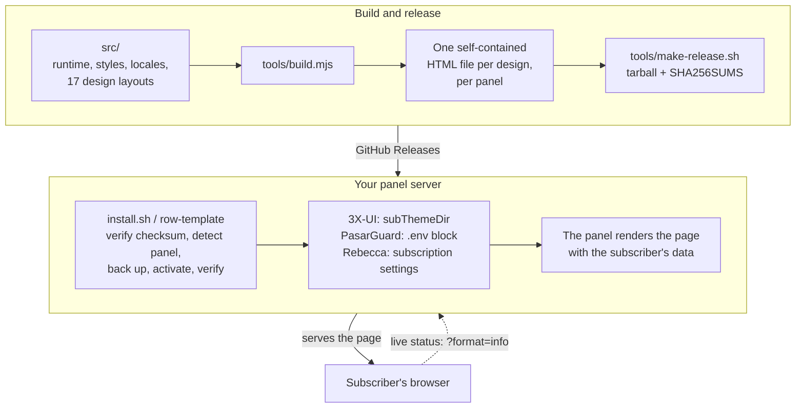

<!-- هویت توسعه دهنده، نشانی مخزن، دستورها، مسیرها، شماره های نسخه و
     نشانی های کیف پول را در این فایل دقیقاً بایت به بایت مانند فایل های
     README ترجمه شده نگه دارید. -->

<p align="center">
  
</p>

<p align="center">
  یک صفحهٔ اشتراک شکیل و خودبسنده برای پنل های <a href="https://github.com/MHSanaei/3x-ui">3X-UI</a>، <a href="https://github.com/PasarGuard/panel">PasarGuard</a> و <a href="https://github.com/rebeccapanel/Rebecca">Rebecca</a> — هفده طرح که هر کدام یک فایل HTML است، کاملاً وایت لیبل، و بدون هیچ درخواستی به شخص ثالث از صفحه ای که مشترکان شما باز می کنند.
</p>

<p align="center">
  <a href="README.md">English</a> | <strong>فارسی</strong> | <a href="README.ar.md">العربية</a> | <a href="README.ru.md">Русский</a> | <a href="README.zh-CN.md">简体中文</a>
</p>

<p align="center">
  <a href="LICENSE"></a>
  <a href="https://github.com/iitzSeriZdev/Row-Template/releases/latest"></a>
  
  
  <a href="https://iitzseridev.github.io/Row-Template/"></a>
</p>

<p align="center">
  <a href="#نصب">نصب</a> ·
  <a href="#طرح-ها">طرح ها</a> ·
  <a href="https://iitzseridev.github.io/Row-Template/fa/">مستندات</a> ·
  <a href="CHANGELOG.md">تغییرات</a> ·
  <a href="https://github.com/iitzSeriZdev/Row-Template/releases">نسخه ها</a>
</p>

---

## Row-Template چیست؟

3X-UI، PasarGuard و Rebecca هر کدام می توانند به جای صفحهٔ داخلی خود، یک صفحهٔ سفارشی به مشترکان نشان دهند. Row-Template همان صفحه است: مشترک پیوند اشتراک خود را باز می کند و پلن، میزان مصرف و تاریخ انقضای خود را می بیند، به همراه راه هایی برای افزودن اشتراک با یک لمس به برنامه ای که استفاده می کند.

برای هر طرح یک فایل HTML خودبسنده عرضه می شود که همهٔ استایل ها، اسکریپت ها، فونت ها و مولد کد QR درون آن گنجانده شده اند، و از هر طرح نسخه ای به زبان قالب خود هر پنل. یک دستور پنل شما را شناسایی می کند، صفحه را کنار آن نصب می کند، پنل را به آن اشاره می دهد و ابزار مدیریتی `row-template` را برای برندسازی، به روزرسانی و بازگردانی در اختیار شما می گذارد.

## چرا Row-Template؟

- **محرمانه از پایه.** صفحه ای که مشترکان شما باز می کنند هیچ درخواستی به شخص ثالث نمی فرستد. کدهای QR روی خود صفحه تولید می شوند و اطلاعات برندسازی شما به صورت متن تزریق می شود — هرگز اجرا نمی شود و هرگز به هیچ جایی فرستاده نمی شود.
- **واقعاً وایت لیبل.** نام سرویس، پیوند پشتیبانی و لوگوی خودتان. هیچ چیزی روی صفحهٔ ارائه شده معرف Row-Template نیست.
- **هفده طرح، هر کدام یک فایل.** ظاهری را انتخاب کنید که به سرویس شما می آید. همهٔ طرح ها ویژگی ها، زبان ها و بررسی های ایمنی یکسانی دارند — روی هر پنل پشتیبانی شده.
- **ساخته شده برای مشترکان شما.** نمای زندهٔ مصرف و انقضا، ورود (import) با یک لمس به برنامه های پرکاربرد، و فهرستی قابل جستجو از پیکربندی های جداگانه برای افزودن دستی یک سرور.
- **ایمن برای بهره برداری.** نسخه هایی که مجموع کنترلی آن ها بررسی می شود، فعال سازی تراکنشی که اگر گامی شکست بخورد پنل را دقیقاً به حالت قبل برمی گرداند، و بازگردانی تک دستوری. هرگز پنل شما را وصله نمی کند: در 3X-UI یک تنظیم (`subThemeDir`) را تغییر می دهد، در PasarGuard یک بلوک نشان دار به `.env` می افزاید، و در Rebecca دو فیلد از تنظیمات اشتراک را مقدار می دهد.

## طرح ها

Row-Template 1.3.0 با هفده طرح عرضه می شود. طرح پیش فرض Row است.

<table>
  <tr>
    <td align="center"><br><sub>Row</sub></td>
    <td align="center"><br><sub>Editorial</sub></td>
    <td align="center"><br><sub>Canvas</sub></td>
    <td align="center"><br><sub>Prism</sub></td>
    <td align="center"><br><sub>Terminal</sub></td>
  </tr>
  <tr>
    <td align="center"><br><sub>Pulse</sub></td>
    <td align="center"><br><sub>Brutal</sub></td>
    <td align="center"><br><sub>Arcade</sub></td>
    <td align="center"><br><sub>Sketch</sub></td>
    <td align="center"><br><sub>Signature</sub></td>
  </tr>
  <tr>
    <td align="center"><br><sub>Saffron</sub></td>
    <td align="center"><br><sub>Pulse Nova</sub></td>
    <td align="center"><br><sub>Prism Nova</sub></td>
    <td align="center"><br><sub>Terminal Nova</sub></td>
    <td align="center"><br><sub>Arcade Nova</sub></td>
  </tr>
  <tr>
    <td align="center"><br><sub>Meter</sub></td>
    <td align="center"><br><sub>Notebook</sub></td>
  </tr>
</table>

<sub>پیش نمایش ها با داده های نمونهٔ خود پروژه ساخته شده اند. پیش نمایش دسکتاپ و موبایل همهٔ طرح ها در <a href="https://iitzseridev.github.io/Row-Template/fa/templates/">گالری طرح ها</a> موجود است.</sub>

طرح را هنگام یک نصب تعاملی تازه انتخاب کنید، برای نصب اسکریپتی `RT_TEMPLATE` را تنظیم کنید، یا بعداً آن را از مدیر تغییر دهید (**Reconfigure branding → Template**). به روزرسانی ها انتخاب شما را حفظ می کنند.

## ویژگی ها

**برای مشترکان شما**

- **وضعیت زنده.** وضعیت پلن، ترافیک مصرف شده و باقی مانده و تاریخ انقضا، که تا وقتی صفحه دیده می شود از پنل شما به روز می شود (در 3X-UI؛ در PasarGuard و Rebecca صفحه مقادیر لحظهٔ باز شدن را نشان می دهد).
- **ورود با یک لمس** به برنامه های پرکاربرد، بر اساس پلتفرم: v2rayNG، Happ و sing-box در Android؛ Streisand، V2Box و Shadowrocket در iOS؛ Clash Verge Rev، Mihomo Party و v2rayN در Windows؛ Clash Verge Rev، Streisand و V2Box در macOS.
- **کپی و QR.** پیوند اشتراک را کپی کنید یا آن را به صورت کد QR که روی خود صفحه ساخته می شود اسکن کنید.
- **کاوشگر پیکربندی ها.** هر سرور در یک ردیف جداگانه، با پرچم کشور یا نشان حروف (monogram) و برچسب پروتکل (VLESS، VMess، Trojan، Shadowsocks، Hysteria/Hysteria2، WireGuard، AmneziaWG، Telegram MTProto)، به همراه QR و کپی برای هر پیکربندی و جستجو برای فهرست های طولانی.
- **پنج زبان** — انگلیسی، فارسی، عربی، روسی و چینی — با چیدمان راست به چپ، و انتخاب پوستهٔ System / Light / Dark.

**برای شما**

- **برندسازی وایت لیبل.** نام سرویس، پیوند پشتیبانی و لوگو، همگی اختیاری، که به عنوان داده ذخیره و به صورت متن تزریق می شوند.
- **یک مدیر برای همه چیز.** منوی تعاملی و دستورهای مستقیم برای برندسازی، به روزرسانی، بررسی سلامت، بازگردانی و حذف نصب.
- **به روزرسانی از کانال پایدار.** `row-template update` هر بار که اجرا شود آخرین نسخهٔ پایدار را پس از بررسی نصب می کند — و به همین دلیل راهی سریع برای تعمیر نصب هم هست.

**حریم خصوصی و ایمنی**

- **بدون درخواست به شخص ثالث** از صفحهٔ ارائه شده: بدون CDN، بدون جستجوی بیرونی QR یا موقعیت جغرافیایی، بدون تله متری. وضعیت زنده از پنل خود شما می آید.
- **SHA-256 الزامی** برای هر دانلود نسخه، بدون هیچ گزینه ای برای رد کردن آن.
- **فعال سازی اتمی.** صفحهٔ جدید پیش از جایگزینی صفحهٔ فعال ساخته و اعتبارسنجی می شود، بنابراین یک گام ناموفق هرگز صفحه ای خراب را فعال باقی نمی گذارد.
- **شناسایی محتاطانهٔ پنل.** یک پنل تنها وقتی نصب شده به حساب می آید که نشانه های مستقل با هم بخوانند؛ پنلی که نیمه نصب شده، یا پایگاه دادهٔ پنلی که یک پایگاه دادهٔ SQLite معتبر نیست، به جای حدس زدن رد می شود.

## پنل های پشتیبانی شده

| پنل | وضعیت | یادداشت ها |
| ----- | ------ | ----- |
| [3X-UI](https://github.com/MHSanaei/3x-ui) (MHSanaei) | ✅ پشتیبانی شده | نیازمند نسخهٔ **>= 3.6.0** |
| [PasarGuard](https://github.com/PasarGuard/panel) | ✅ پشتیبانی شده از 1.3.0 | نصب رسمی Docker یا نصب از سورس (`pasarguard.service`) |
| [Rebecca](https://github.com/rebeccapanel/Rebecca) | ✅ پشتیبانی شده از 1.3.0 | Rebecca نسخهٔ **1.x**، نسخهٔ Go (نصب باینری Rebecca). فعال سازی خودکار با SQLite و `sqlite3`؛ با MySQL/MariaDB یک تنظیم که باید در داشبورد وارد شود. ایمیج Docker هنوز 0.0.x است و رد می شود |

این سه پنل از سه موتور قالب متفاوت استفاده می کنند — `html/template` زبان Go، Jinja2 و pongo2 — پس هر طرح برای هر پنل یک بار ساخته می شود و هر نسخه با رندر شدن توسط موتور واقعی همان پنل آزموده می شود. نصب کننده تشخیص می دهد کدام پنل روی سرور است؛ روی سروری با بیش از یک پنل، از شما می پرسد (یا `RT_PANEL` را می خواند). **پشتیبانی‌شده** یعنی هر هفت توانایی روی آن پنل موجود است — تشخیص، نصب، فعال‌سازی، بررسی، پشتیبان‌گیری، بازگردانی و حذف نصب — و هر کدام توسط مجموعهٔ آزمون آزموده می شود. برای جزئیات هر پنل، [سازگاری](https://iitzseridev.github.io/Row-Template/fa/compatibility/) را ببینید.

## معماری



- **یک فایل برای هر طرح.** `tools/build.mjs` کد اجرایی مشترک، ترجمه ها، فونت ها و مولد QR را درون چیدمان هر طرح می گنجاند و چیدمانی را که هر یک از قلاب های (hook) مورد نیاز کد اجرایی را نداشته باشد رد می کند. سپس `tools/verify.mjs` هر فایلی را که چیزی را از راه دور بارگذاری کند یا ساختاری ممنوع داشته باشد رد می کند.
- **رندر را پنل انجام می دهد.** صفحه یک قالب است: پنل هنگام ارائهٔ آن داده های مشترک را در آن قرار می دهد. برای PasarGuard (Jinja2) و Rebecca (pongo2) هر طرح درون یک پیش درآمد کوچک قرار می گیرد که داده های خود پنل را به صفحه نگاشت می کند و هر مقدار را escape می کند.
- **نصب کننده هرگز پنل شما را وصله نمی کند.** در 3X-UI، `subThemeDir` را به دایرکتوری خودش اشاره می دهد؛ در PasarGuard صفحه را در دایرکتوری قالب ها می گذارد و یک بلوک نشان دار به انتهای `.env` می افزاید؛ در Rebecca صفحه را می گذارد و فیلدهای صفحه و دایرکتوری تنظیمات اشتراک را مقدار می دهد. از هر تغییر پیش از انجام یک snapshot گرفته می شود و اگر چیزی شکست بخورد دقیقاً بازگردانده می شود.

| مسیر | محتوا |
| ---- | ---------------- |
| `src/` | کد اجرایی، استایل ها و ترجمه های صفحه؛ هر طرح در `src/templates/<id>/` |
| `template/index.html` | صفحهٔ ساخته شدهٔ Row، که commit شده است |
| `tools/` | ساخت، اعتبارسنجی، انتشار و رندرکنندهٔ Go برای fixtureها |
| `installer/` | `install.sh`، دستور `row-template`، کتابخانهٔ مدیریتی آن و یک آداپتور برای هر پنل در `installer/panels/` |
| `tests/` | مجموعه های آزمون |
| `docs/` | سایت مستندات؛ سوابق طراحی در [`docs/design/`](docs/design/README.md) |

## نصب

> **سیستم عامل پیشنهادی: Ubuntu 24.04 LTS (x86_64).** دیگر توزیع های امروزی لینوکس نیز ممکن است کار کنند، اما پوشش اعتبارسنجی یکسانی نداشته اند.

**پیش نیازها:** سروری با 3X-UI **>= 3.6.0**، PasarGuard یا Rebecca **1.x**؛ دسترسی root به آن؛ و `curl`، `tar` و `sha256sum` (که تقریباً روی همهٔ سیستم های لینوکس موجود است). فعال سازی خودکار در 3X-UI و Rebecca به `sqlite3` هم نیاز دارد.

با کاربر **root** روی سروری که پنل شما را میزبانی می کند اجرا کنید:

```bash
bash <(curl -fsSL https://github.com/iitzSeriZdev/Row-Template/releases/latest/download/install.sh)
```

نصب کننده:

1. آخرین نسخهٔ پایدار را از GitHub دانلود می کند.
2. مجموع کنترلی SHA-256 آن را بررسی می کند (الزامی — بدون امکان دور زدن).
3. پنل شما را شناسایی می کند، نسخه را به شکل ایمن استخراج می کند و در `/etc/3x-ui/sub_templates/row-template` (3X-UI) یا `/etc/row-template` (PasarGuard، Rebecca) نصب می کند.
4. در نصب تازه، انتخابگر طرح را نشان می دهد (Enter طرح Row را نگه می دارد).
5. برای برندسازی شما درخواست ورودی می دهد (نام سرویس، پیوند پشتیبانی، لوگو — همگی اختیاری).
6. صفحه را تولید و اعتبارسنجی می کند و سپس در صورت امکان آن را در پنل فعال می کند.

برای انتخاب طرح بدون انتخابگر، برای نمونه در یک اسکریپت:

```bash
RT_TEMPLATE=editorial bash <(curl -fsSL https://github.com/iitzSeriZdev/Row-Template/releases/latest/download/install.sh)
```

روی سروری که بیش از یک پنل پشتیبانی شده دارد، نصب کننده می پرسد کدام را سرویس دهد؛ در یک اسکریپت، آن را با `RT_PANEL` (`3xui`، `pasarguard` یا `rebecca`) مشخص کنید:

```bash
RT_PANEL=pasarguard bash <(curl -fsSL https://github.com/iitzSeriZdev/Row-Template/releases/latest/download/install.sh)
```

اگر ترجیح می دهید از طریق شبکه به صورت pipe عمل نکنید، چهار فایل نسخه (`install.sh`، `manifest.txt`، `SHA256SUMS` و `row-template-<version>.tar.gz`) را از [صفحهٔ Releases](https://github.com/iitzSeriZdev/Row-Template/releases/latest) در یک پوشه دانلود کنید، مجموع کنترلی را خودتان همان گونه که در [PROVENANCE.md](PROVENANCE.md) توضیح داده شده بررسی کنید و نصب کننده را به آن پوشه ارجاع دهید:

```bash
RT_RELEASE_DIR=/root/row-template-release bash /root/row-template-release/install.sh
```

### فعال سازی

نصب تعاملی ابتدا نشان می دهد فعال سازی چه چیزی را تغییر می دهد و پیش از تغییر از شما می پرسد. در PasarGuard و Rebecca فعال سازی به صورت یک تراکنش اجرا می شود: از وضعیت پنل snapshot گرفته می شود، تغییر اعمال و بررسی می شود، و اگر گامی شکست بخورد، پنل دقیقاً به حالت قبل بازگردانده می شود.

**3X-UI.** Row-Template در دایرکتوری ای نصب می شود که پنل آن را به عنوان صفحهٔ اشتراک ارائه می دهد:

```
/etc/3x-ui/sub_templates/row-template
```

- **خودکار:** هنگامی که `sqlite3` در دسترس باشد، Row-Template آن را برای شما تنظیم می کند. سرویس پنل را برای مدت کوتاهی متوقف می کند، تنظیم را می نویسد، سرویس را دوباره راه اندازی می کند و مقدار را بررسی می کند.
- **دستی:** در غیر این صورت، **Panel Settings → Subscription → Profile → Sub Theme Directory** را باز کنید و دقیقاً این را وارد کنید:

  ```
  /etc/3x-ui/sub_templates/row-template
  ```

**PasarGuard.** صفحه در `/var/lib/pasarguard/templates/row-template/index.html` قرار می گیرد (یا درون `CUSTOM_TEMPLATES_DIRECTORY` خودتان، اگر تنظیمش کرده باشید)، و یک بلوک نشان دار به انتهای `/opt/pasarguard/.env` افزوده می شود:

```
# >>> row-template (managed by Row-Template; do not edit) nl=0 >>>
CUSTOM_TEMPLATES_DIRECTORY = "/var/lib/pasarguard/templates"
SUBSCRIPTION_PAGE_TEMPLATE = "row-template/index.html"
# <<< row-template <<<
```

PasarGuard فایل `.env` را هنگام راه اندازی می خواند، پس پنلی که در حال اجراست یک بار راه اندازی مجدد می شود. هیچ یک از خط های خودتان ویرایش نمی شود؛ حذف نصب بلوک را برمی دارد و `.env` را دقیقاً به بایت های قبلی اش بازمی گرداند. ادمینی که قالب اشتراک خودش را دارد، یا تنظیم **disable subscription template**، همچنان مقدم است — `row-template verify` به شما می گوید اگر یکی از آن ها برقرار باشد.

Row-Template از Rebecca نسخهٔ **1.x** پشتیبانی می کند، یعنی نسخهٔ Go که Rebecca برای نصب باینری خود (`rebecca-binary.sh`) منتشر می کند. ایمیج `rebeccapanel/rebecca` در Docker Hub هنوز نسخهٔ 0.0.x پایتونی است که نمی تواند این صفحه را رندر کند؛ نصب کننده آن را رد می کند و چیزی را تغییر نمی دهد، و دستور `rebecca migrate-binary` خود Rebecca یک نصب Docker را به 1.x منتقل می کند.

**Rebecca.** صفحه در `/var/lib/rebecca/templates/row-template/index.html` قرار می گیرد (یا درون دایرکتوری قالب های سفارشی خودتان)، و تنظیمات اشتراک Rebecca روی `row-template/index.html` تنظیم می شود. Rebecca این تنظیمات را در هر درخواست می خواند، پس نیازی به راه اندازی مجدد نیست.

- **خودکار** با پایگاه دادهٔ پیش فرض SQLite و نصب بودن `sqlite3`.
- **دستی** با MySQL/MariaDB (یا بدون `sqlite3`): صفحه همچنان جایگذاری می شود؛ در داشبورد Rebecca، **Settings → Subscription → Templates** را باز کنید و **Subscription page template** را `row-template/index.html` و **Custom templates directory** را `/var/lib/rebecca/templates` قرار دهید.

## استفاده

مدیر را بدون هیچ آرگومانی در ترمینال اجرا کنید تا منوی تعاملی باز شود:

```bash
row-template
```

یا یک دستور را مستقیماً اجرا کنید:

| دستور | کارکرد |
| ------- | ------------ |
| `row-template config` | تغییر نام سرویس، پیوند پشتیبانی یا لوگو و سپس بازسازی صفحه |
| `row-template update` | دانلود، بررسی و فعال سازی آخرین نسخهٔ پایدار (بررسی مجموع کنترلی الزامی) |
| `row-template rollback` | بازگردانی یک نسخهٔ پیشین (`--auto` یا `--to <backup>`) |
| `row-template verify` | بررسی نصب، اتصال به پنل و صفحهٔ فعال (با دسترسی root، طرح های گم شده یا جابه جا شده را هم به جای خود برمی گرداند) |
| `row-template version` | نمایش نسخهٔ نصب شده و پنلی که به آن سرویس می دهد (در 3X-UI، حداقل نسخهٔ پشتیبانی شده و نسخهٔ شناسایی شده را هم) |
| `row-template uninstall` | حذف Row-Template و بازگرداندن پنل به صفحه ای که پیش تر داشت |
| `row-template help` | نمایش راهنمای استفاده |

دستورهایی که سیستم را تغییر می دهند (`config`، `update`، `rollback`، `uninstall`) باید با root اجرا شوند.

- **برندسازی** به عنوان داده ذخیره می شود، هرگز اجرا نمی شود و به صورت متن در صفحه تزریق می گردد. برای یک صفحهٔ بدون برند، فیلدی را خالی بگذارید. پیوند پشتیبانی تنها پروتکل هایی را می پذیرد که مرورگر باید باز کند، مانند `https://…`، `tg://…` یا `mailto:…`.
- **به روزرسانی ها** از کانال عمومی نسخه های پایدار می آیند. `row-template update` همیشه آخرین نسخهٔ پایدار را اعمال می کند، حتی اگر همان نسخه را داشته باشید؛ گزینهٔ **Update** در منوی مدیریت ابتدا نسخه ها را مقایسه می کند و پیش از هر تغییری می پرسد. اگر منبع انتشار در دسترس نباشد، چیزی تغییر نمی کند و نصب شما هرگز آسیب دیده تلقی نمی شود.
- **به روزرسانی از 1.1.0 یا 1.2.x** با یک بار اجرای `row-template update` انجام می شود. به روزرسان خود 1.1.0 فقط بخشی از نسخهٔ جدید را کپی می کند، برای همین اجرای بعدی `row-template`، `row-template config` یا `row-template verify` با دسترسی root، ابتدا بقیهٔ همان نسخه را دریافت می کند — همهٔ طرح ها، با بررسی checksum. طرح، برندسازی و اتصال پنل شما حفظ می شوند.
- **بازگردانی** یک نسخهٔ پیشین را از یک پشتیبان اعتبارسنجی شده بازیابی می کند. ابتدا از نسخهٔ فعلی یک عکس فوری (snapshot) گرفته می شود تا یک بازگردانی ناموفق قابل جبران باشد، و برندسازی شما حفظ می شود. پشتیبان ها پنلی را که روی آن ساخته شده اند ثبت می کنند و هرگز روی پنل دیگری بازگردانده نمی شوند؛ پشتیبانی از یک نسخهٔ قدیمی تر که نام طرحش را ثبت نکرده، به صورت Row بازگردانده می شود.
- **حذف نصب** فایل های Row-Template را حذف می کند و پنل را به صفحه ای که پیش تر داشت بازمی گرداند: در 3X-UI، `subThemeDir` را تنها در صورتی پاک می کند که به Row-Template اشاره کند؛ در PasarGuard بلوک `.env` و صفحهٔ خودش را برمی دارد؛ در Rebecca دو تنظیم اشتراکی را که تغییر داده بازمی گرداند (و اگر از آن پس صفحهٔ دیگری انتخاب کرده باشید، به آن ها دست نمی زند). به کاربران، inboundها، کلاینت ها، نودها و گواهی های شما دست زده نمی شود.

[مستندات](https://iitzseridev.github.io/Row-Template/fa/) پیکربندی، برندسازی و رفع اشکال را با جزئیات بیشتری پوشش می دهد.

## توسعه

صفحه ها از منابع خوانای موجود در `src/` ساخته می شوند. به Node.js نسخهٔ 22 یا بالاتر نیاز دارید؛ برای اجرای آزمون ها همچنین به Go نسخهٔ 1.22 یا بالاتر و Python 3 همراه Jinja2 (`pip install jinja2`) که صفحه های PasarGuard و Rebecca را با موتورهای واقعی همان پنل ها رندر می کنند.

```bash
npm run build          # regenerate template/index.html from src/
npm run verify         # check the built page against the safety gates
npm test               # render the fixture pages, then run every test suite
npm run fixtures:all   # render every design's fixture pages on their own
npm run lint:sh        # ShellCheck every shell script
npm run preview        # preview the fixture pages at http://127.0.0.1:8787
```

فرآیند ساخت قطعی (deterministic) است — منابع یکسان همیشه یک `template/index.html` با بایت های یکسان تولید می کنند. سایت مستندات یک فضای کاری جداگانه در `docs/` است؛ [docs/README.md](docs/README.md) را ببینید.

## آزمون

- **`npm test`** ابتدا صفحه های fixture همهٔ طرح ها را با رندرکنندهٔ Go می سازد و سپس مجموعه های آزمون را اجرا می کند: اسکریپت های صفحه، فرآیند ساخت، فایل نهایی هر طرح، صفحه های PasarGuard و Rebecca که با Jinja2 و pongo2 واقعی رندر می شوند (از جمله با داده های مخرب و ناقص)، محتوای بستهٔ انتشار و نصب کننده — که کتابخانهٔ shell منتشرشده و آداپتور هر پنل را در یک `bash` واقعی روی میزبان های موقتی اجرا می کند که مانند نصب رسمی هر پنل چیده شده اند.
- **`npm run verify`** یک صفحهٔ ساخته شده را با دروازه های ایمنی آن می سنجد، از جمله: سند کامل، جایگزینی همهٔ نشانگرهای ساخت، گنجاندن همه چیز در فایل، نبود ارجاع راه دور، نبود ساختارهای ممنوع، سالم بودن ترجمه ها و نبود نویسه های نامرئی در منابع.
- **`npm run lint:sh`** با هر خطای ShellCheck شکست می خورد؛ `npm run lint:sh -- -S warning` گزارش کامل را نشان می دهد.
- **گردش کار Docs** سایت مستندات را در هر pull request که آن را تغییر دهد می سازد.

## نقشهٔ راه

جهت گیری، نه وعده:

- **Row-Template 1.3.0** — پشتیبانی از PasarGuard و Rebecca، و طرح های Meter و Notebook، که در بالا توضیح داده شد.
- **وضعیت زنده در PasarGuard و Rebecca** — هر دو آن را روی یک پسوند مسیر ارائه می دهند نه `?format=info`؛ اتصال آن به یک تغییر کوچک در کد اجرایی نیاز دارد و این تصمیم به تعویق افتاده است. [سازگاری](https://iitzseridev.github.io/Row-Template/fa/compatibility/) را ببینید.
- **قالب های سفارشی** — پیشنهادی برای افزودن طرح خودتان: [`docs/design/CUSTOM-TEMPLATES-PROPOSAL.md`](docs/design/CUSTOM-TEMPLATES-PROPOSAL.md).

## مشارکت

گزارش اشکال، ترجمه و اصلاح مستندات بسیار استقبال می شود. پیش از باز کردن pull request، [CONTRIBUTING.md](CONTRIBUTING.md) را بخوانید و از [آیین نامهٔ رفتاری](CODE_OF_CONDUCT.md) پیروی کنید.

**گزارش اشکال:** یک issue در <https://github.com/iitzSeriZdev/Row-Template/issues> باز کنید. نسخهٔ Row-Template خود (`row-template version`)، پنل شما و نسخهٔ آن، سیستم عامل و نسخهٔ آن، معماری پردازنده، خروجی `row-template verify` و گام های روشن برای بازتولید مشکل را ذکر کنید.

> **هیچ گونه اطلاعات محرمانه درج نکنید.** هرگز URLهای اشتراک، مقادیر `subId`، UUIDهای کلاینت، نام کاربری یا گذرواژهٔ پنل، کوکی ها، توکن ها، `webBasePath` پنل، محتوای `.env`، URLهای پایگاه داده، کلیدهای TLS یا نشانی های واقعی سرور را وارد نکنید. پیش از اشتراک گذاری لاگ ها، آن ها را ویرایش و پاک سازی کنید.

## امنیت

آیا آسیب پذیری یافته اید؟ لطفاً آن را به صورت خصوصی گزارش دهید — [SECURITY.md](SECURITY.md) را ببینید. برای مشکلات امنیتی یک issue عمومی باز نکنید. [PROVENANCE.md](PROVENANCE.md) توضیح می دهد که نسخه ها چگونه ساخته می شوند و چگونه می توان آن ها را بررسی کرد.

## حمایت از پروژه

Row-Template رایگان و متن باز است. اگر در وقت شما صرفه جویی می کند، می توانید از توسعهٔ آن حمایت کنید:

- **USDT (BEP20 / BNB Smart Chain):**

  ```
  0x2606551375987cec71F5fC033968B638A7a4bae4
  ```

- **TRON:**

  ```
  TYD5RFfiYrcETzWNSkAhfwgmRu1wQBbs6W
  ```

- **NOWPayments:** <https://nowpayments.io/donation/iitzSeriZ>

با تشکر.

## مجوز

تحت [مجوز MIT](LICENSE) منتشر شده است. مولد کد QR همراه بسته (`src/vendor/uqr`) تحت مجوز MIT خودش، و زیرمجموعهٔ فونت Vazirmatn که درون صفحه گنجانده شده تحت مجوز SIL Open Font License (`src/fonts/OFL.txt`) عرضه می شوند.

## توسعه دهنده

ساخته و نگهداری شده توسط **iitzSeriZdev** — <https://github.com/iitzSeriZdev/Row-Template>
