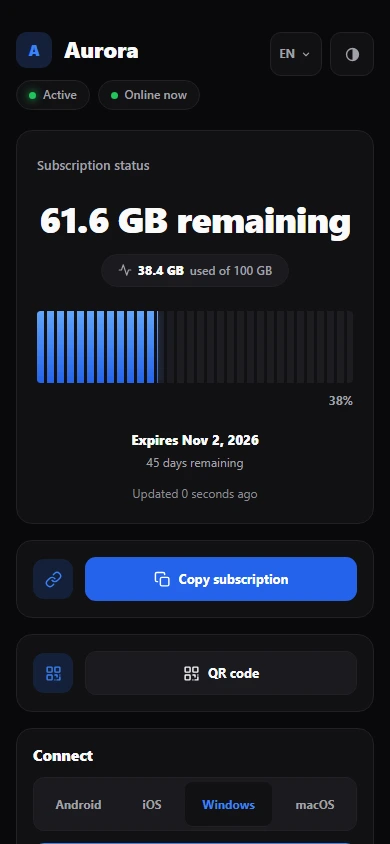
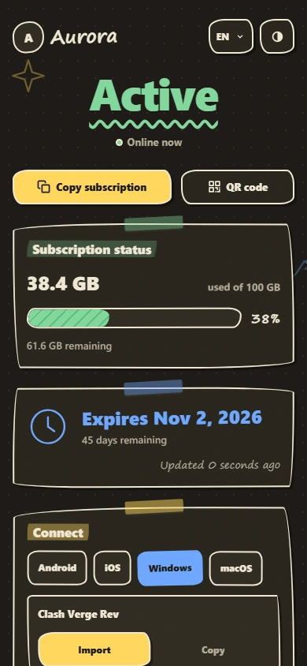
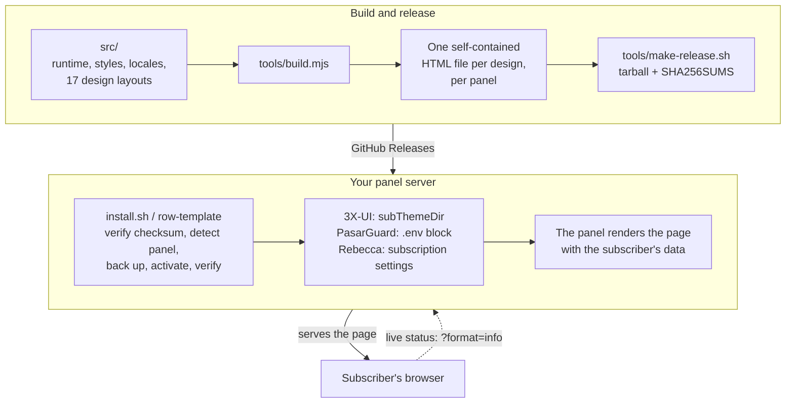

<!-- Keep the developer identity, repository URL, commands, paths, version
     numbers, and wallet addresses in this file byte-for-byte identical to the
     translated READMEs. -->

<p align="center">
  
</p>

<p align="center">
  A polished, self-contained subscription page for <a href="https://github.com/MHSanaei/3x-ui">3X-UI</a>, <a href="https://github.com/PasarGuard/panel">PasarGuard</a> and <a href="https://github.com/rebeccapanel/Rebecca">Rebecca</a> panels — seventeen designs, each a single HTML file, fully white-label, with no third-party requests from the page your subscribers open.
</p>

<p align="center">
  <strong>English</strong> | <a href="README.fa.md">فارسی</a> | <a href="README.ar.md">العربية</a> | <a href="README.ru.md">Русский</a> | <a href="README.zh-CN.md">简体中文</a>
</p>

<p align="center">
  <a href="LICENSE"></a>
  <a href="https://github.com/iitzSeriZdev/Row-Template/releases/latest"></a>
  
  
  <a href="https://iitzseridev.github.io/Row-Template/"></a>
</p>

<p align="center">
  <a href="#installation">Install</a> ·
  <a href="#designs">Designs</a> ·
  <a href="https://iitzseridev.github.io/Row-Template/">Documentation</a> ·
  <a href="CHANGELOG.md">Changelog</a> ·
  <a href="https://github.com/iitzSeriZdev/Row-Template/releases">Releases</a>
</p>

---

## What it is

3X-UI, PasarGuard and Rebecca can each serve a custom page to subscribers instead of their built-in one. Row-Template is that page: a subscriber opens their subscription link and sees their plan, their usage, their expiry date, and one-tap ways to add the subscription to the app they use.

It ships as one self-contained HTML file per design, with every style, script, font, and the QR code generator inlined, and a version of each design in every panel's own template language. A single command detects your panel, installs the page next to it, points the panel at it, and gives you a `row-template` manager for branding, updates, and rollback.

## Why Row-Template?

- **Private by design.** The page your subscribers open makes no third-party requests. QR codes are generated on the page, and your branding is injected as text — never executed, never sent anywhere.
- **Genuinely white-label.** Your service name, your support link, your logo. Nothing on the served page identifies Row-Template.
- **Seventeen designs, one file each.** Pick the look that fits your service. Every design shares the same features, languages, and safety checks — on every supported panel.
- **Made for your subscribers.** Live usage and expiry, one-tap import into popular apps, and a searchable list of individual configurations for adding a single server by hand.
- **Safe to operate.** Checksum-verified releases, transactional activation that restores the panel exactly if any step fails, and one-command rollback. It never patches your panel: on 3X-UI it changes one setting (`subThemeDir`), on PasarGuard it adds one marked block to `.env`, and on Rebecca it sets two fields of its subscription settings.

## Designs

Row-Template 1.3.0 ships seventeen designs. Row is the default.

<table>
  <tr>
    <td align="center"><br><sub>Row</sub></td>
    <td align="center"><br><sub>Editorial</sub></td>
    <td align="center"><br><sub>Canvas</sub></td>
    <td align="center"><br><sub>Prism</sub></td>
    <td align="center"><br><sub>Terminal</sub></td>
  </tr>
  <tr>
    <td align="center"><br><sub>Pulse</sub></td>
    <td align="center"><br><sub>Brutal</sub></td>
    <td align="center"><br><sub>Arcade</sub></td>
    <td align="center"><br><sub>Sketch</sub></td>
    <td align="center"><br><sub>Signature</sub></td>
  </tr>
  <tr>
    <td align="center"><br><sub>Saffron</sub></td>
    <td align="center"><br><sub>Pulse Nova</sub></td>
    <td align="center"><br><sub>Prism Nova</sub></td>
    <td align="center"><br><sub>Terminal Nova</sub></td>
    <td align="center"><br><sub>Arcade Nova</sub></td>
  </tr>
  <tr>
    <td align="center"><br><sub>Meter</sub></td>
    <td align="center"><br><sub>Notebook</sub></td>
  </tr>
</table>

<sub>Previews are rendered from the project's own placeholder data. Desktop and mobile previews of every design are in the <a href="https://iitzseridev.github.io/Row-Template/templates/">template gallery</a>.</sub>

Choose a design during a fresh interactive install, set `RT_TEMPLATE` for a scripted one, or change it later from the manager (**Reconfigure branding → Template**). Updates keep your choice.

## Features

**For your subscribers**

- **Live status.** Plan state, traffic used and remaining, and expiry, refreshed from your panel while the page is visible (3X-UI; on PasarGuard and Rebecca the page shows the values as of when it was opened).
- **One-tap import** into popular apps, grouped by platform: v2rayNG, Happ and sing-box on Android; Streisand, V2Box and Shadowrocket on iOS; Clash Verge Rev, Mihomo Party and v2rayN on Windows; Clash Verge Rev, Streisand and V2Box on macOS.
- **Copy and QR.** Copy the subscription link or scan it as a QR code generated on the page.
- **Configuration Explorer.** Every server on its own row, with a country flag or monogram and a protocol label (VLESS, VMess, Trojan, Shadowsocks, Hysteria/Hysteria2, WireGuard, AmneziaWG, Telegram MTProto), plus per-configuration QR and copy, and search for long lists.
- **Five languages** — English, Persian, Arabic, Russian, and Chinese — with right-to-left layout, and a System / Light / Dark theme choice.

**For you**

- **White-label branding.** Service name, support link, and logo, all optional, stored as data and injected as text.
- **A manager for everything.** An interactive menu and direct commands for branding, updates, verification, rollback, and uninstall.
- **Stable-channel updates.** `row-template update` installs the latest stable release, verified, whenever you run it — which also makes it a quick repair.

**Privacy and safety**

- **No third-party requests** from the served page: no CDNs, no external QR or geolocation lookups, no telemetry. Live status comes from your own panel.
- **Mandatory SHA-256** verification of every release download, with no option to skip it.
- **Atomic activation.** A new page is generated and validated before it replaces the live one, so a failed step never leaves a broken page live.
- **Fail-closed panel detection.** A panel counts as installed only when independent signals agree; a half-installed panel, or a panel database that is not a valid SQLite database, is refused rather than guessed at.

## Supported panels

| Panel | Status | Notes |
| ----- | ------ | ----- |
| [3X-UI](https://github.com/MHSanaei/3x-ui) (MHSanaei) | ✅ Supported | Requires version **>= 3.6.0** |
| [PasarGuard](https://github.com/PasarGuard/panel) | ✅ Supported since 1.3.0 | The official Docker install or a source install (`pasarguard.service`) |
| [Rebecca](https://github.com/rebeccapanel/Rebecca) | ✅ Supported since 1.3.0 | Rebecca **1.x**, the Go edition (Rebecca's binary install). Automatic activation with SQLite and `sqlite3`; with MySQL/MariaDB, one setting to enter in the dashboard. The Docker image is still 0.0.x and is refused |

The three panels use three different template engines — Go `html/template`, Jinja2 and pongo2 — so every design is built once per panel, and each version is tested by rendering it with that panel's real engine. The installer detects which panel is on the server; on a server with more than one, it asks (or reads `RT_PANEL`). **Supported** means all seven capabilities are present on that panel — detect, install, activate, verify, backup, restore and uninstall — and each one is exercised by the test suite. See [Compatibility](https://iitzseridev.github.io/Row-Template/compatibility/) for the details of each panel.

## Architecture



- **One file per design.** `tools/build.mjs` inlines the shared runtime, the translations, the fonts, and the QR generator into a design's layout, and refuses a layout that is missing any hook the runtime needs. `tools/verify.mjs` then rejects an artifact that loads anything remote or carries a forbidden construct.
- **The panel does the rendering.** The page is a template: the panel fills in the subscriber's data when it serves it. For PasarGuard (Jinja2) and Rebecca (pongo2) each design is wrapped in a small prelude that maps the panel's own data onto the page and escapes every value.
- **The installer never patches your panel.** On 3X-UI it points `subThemeDir` at its own directory; on PasarGuard it places the page in the templates directory and appends one marked block to `.env`; on Rebecca it places the page and sets the page and directory fields of its subscription settings. Each change is snapshotted first and restored exactly if anything fails.

| Path | What lives there |
| ---- | ---------------- |
| `src/` | The page's runtime, styles, and translations; each design in `src/templates/<id>/` |
| `template/index.html` | The built Row page, committed |
| `tools/` | Build, verification, release, and the Go fixture renderer |
| `installer/` | `install.sh`, the `row-template` command, its management library, and one adapter per panel in `installer/panels/` |
| `tests/` | The test suites |
| `docs/` | The documentation site; design records in [`docs/design/`](docs/design/README.md) |

## Installation

> **Recommended OS: Ubuntu 24.04 LTS (x86_64).** Other modern Linux distributions may work but have not had the same validation coverage.

**Requirements:** a server running 3X-UI **>= 3.6.0**, PasarGuard, or Rebecca **1.x**; root access to it; and `curl`, `tar`, and `sha256sum` (present on virtually all Linux systems). Automatic activation on 3X-UI and Rebecca also needs `sqlite3`.

Run as **root** on the server that hosts your panel:

```bash
bash <(curl -fsSL https://github.com/iitzSeriZdev/Row-Template/releases/latest/download/install.sh)
```

The installer:

1. Downloads the latest stable release from GitHub.
2. Verifies its SHA-256 checksum (mandatory — no bypass).
3. Detects your panel, extracts the release safely and installs to `/etc/3x-ui/sub_templates/row-template` (3X-UI) or `/etc/row-template` (PasarGuard, Rebecca).
4. On a fresh install, offers the design chooser (Enter keeps Row).
5. Prompts for your branding (service name, support link, logo — all optional).
6. Generates and validates the page, then activates it in the panel where possible.

To choose a design without the chooser, for example in a script:

```bash
RT_TEMPLATE=editorial bash <(curl -fsSL https://github.com/iitzSeriZdev/Row-Template/releases/latest/download/install.sh)
```

On a server that runs more than one supported panel, the installer asks which one to serve; in a script, name it with `RT_PANEL` (`3xui`, `pasarguard` or `rebecca`):

```bash
RT_PANEL=pasarguard bash <(curl -fsSL https://github.com/iitzSeriZdev/Row-Template/releases/latest/download/install.sh)
```

If you prefer not to pipe from the network, download the four release assets (`install.sh`, `manifest.txt`, `SHA256SUMS`, and `row-template-<version>.tar.gz`) from the [Releases page](https://github.com/iitzSeriZdev/Row-Template/releases/latest) into one folder, verify the checksum yourself as described in [PROVENANCE.md](PROVENANCE.md), and point the installer at that folder:

```bash
RT_RELEASE_DIR=/root/row-template-release bash /root/row-template-release/install.sh
```

### Activation

An interactive install shows what activation will change and asks first. On PasarGuard and Rebecca, activation runs as a transaction: the panel's state is snapshotted, changed, verified, and — if any step fails — restored exactly.

**3X-UI.** Row-Template installs to a directory that the panel serves as its subscription page:

```
/etc/3x-ui/sub_templates/row-template
```

- **Automatic:** when `sqlite3` is available, Row-Template sets it for you. It briefly stops the panel service, writes the setting, starts the service again, and checks the value.
- **Manual:** otherwise, open **Panel Settings → Subscription → Profile → Sub Theme Directory** and enter exactly:

  ```
  /etc/3x-ui/sub_templates/row-template
  ```

**PasarGuard.** The page is placed at `/var/lib/pasarguard/templates/row-template/index.html` (or inside your own `CUSTOM_TEMPLATES_DIRECTORY`, if you set one), and a marked block is appended to `/opt/pasarguard/.env`:

```
# >>> row-template (managed by Row-Template; do not edit) nl=0 >>>
CUSTOM_TEMPLATES_DIRECTORY = "/var/lib/pasarguard/templates"
SUBSCRIPTION_PAGE_TEMPLATE = "row-template/index.html"
# <<< row-template <<<
```

PasarGuard reads `.env` at start-up, so a running panel is restarted once. None of your own lines are edited; uninstall removes the block and returns `.env` to its exact previous bytes. An admin with their own subscription template, or the **disable subscription template** setting, still takes precedence — `row-template verify` tells you when either applies.

Row-Template supports Rebecca **1.x**, the Go edition, which Rebecca publishes for its binary install (`rebecca-binary.sh`). Docker Hub's `rebeccapanel/rebecca` image is still the 0.0.x Python edition, which cannot render this page; the installer refuses it and changes nothing, and Rebecca's own `rebecca migrate-binary` moves a Docker install to 1.x.

**Rebecca.** The page is placed at `/var/lib/rebecca/templates/row-template/index.html` (or inside your own custom templates directory), and Rebecca's subscription settings are set to `row-template/index.html`. Rebecca reads them on every request, so no restart is needed.

- **Automatic** with the default SQLite database and `sqlite3` installed.
- **Manual** with MySQL/MariaDB (or without `sqlite3`): the page is still placed; in the Rebecca dashboard open **Settings → Subscription → Templates** and set **Subscription page template** to `row-template/index.html` and **Custom templates directory** to `/var/lib/rebecca/templates`.

## Usage

Run the manager with no arguments in a terminal to open the interactive menu:

```bash
row-template
```

Or use a command directly:

| Command | What it does |
| ------- | ------------ |
| `row-template config` | Change the service name, support link, or logo, then regenerate the page |
| `row-template update` | Download, verify, and activate the latest stable release (checksum enforced) |
| `row-template rollback` | Restore a previous version (`--auto` or `--to <backup>`) |
| `row-template verify` | Check the install, the panel wiring, and the live page (as root, it also puts back missing or misplaced designs) |
| `row-template version` | Show the installed version and the panel it serves (on 3X-UI, also the minimum-supported and detected versions) |
| `row-template uninstall` | Remove Row-Template and return the panel to the page it had before |
| `row-template help` | Show usage |

Commands that change the system (`config`, `update`, `rollback`, `uninstall`) must run as root.

- **Branding** is stored as data, never executed, and injected into the page as text. Leave a field blank for an unbranded page. The support link accepts only schemes a browser should open, such as `https://…`, `tg://…`, or `mailto:…`.
- **Updates** come from the public stable channel. `row-template update` always applies the latest stable release, even the version you already run; the manager's **Update** compares versions first and asks before changing anything. If the release source is unreachable, nothing is changed and your installation is never treated as damaged.
- **Updating from 1.1.0 or 1.2.x** takes one `row-template update`. 1.1.0's own updater copies only part of the new release, so the next `row-template`, `row-template config`, or `row-template verify` run as root first downloads the rest of that same release — every design, checksum-verified. Your design, branding, and panel wiring are kept.
- **Rollback** restores a previous version from a validated backup. The current version is snapshotted first, so a failed rollback can be recovered, and your branding is preserved. Backups record the panel they were made on and are never restored onto another; a backup from an older release that does not name its design restores as Row.
- **Uninstall** removes Row-Template's files and returns the panel to the page it had before: on 3X-UI it clears `subThemeDir` only if it points at Row-Template; on PasarGuard it removes its `.env` block and its page; on Rebecca it restores the two subscription settings it changed (leaving them alone if you have since chosen another page). Your users, inbounds, clients, nodes, and certificates are not touched.

The [documentation](https://iitzseridev.github.io/Row-Template/) covers configuration, branding, and troubleshooting in more depth.

## Development

The pages are built from readable sources in `src/`. You need Node.js 22 or newer; to run the tests, also Go 1.22 or newer and Python 3 with Jinja2 (`pip install jinja2`), which render the PasarGuard and Rebecca pages with those panels' real engines.

```bash
npm run build          # regenerate template/index.html from src/
npm run verify         # check the built page against the safety gates
npm test               # render the fixture pages, then run every test suite
npm run fixtures:all   # render every design's fixture pages on their own
npm run lint:sh        # ShellCheck every shell script
npm run preview        # preview the fixture pages at http://127.0.0.1:8787
```

The build is deterministic — the same sources always produce a byte-identical `template/index.html`. The documentation site is a separate workspace in `docs/`; see [docs/README.md](docs/README.md).

## Testing

- **`npm test`** renders every design's fixture pages with the Go renderer, then runs the suites: the page's scripts, the build, every design's artifact, the PasarGuard and Rebecca pages rendered by real Jinja2 and pongo2 (including hostile and malformed data), the release payload, and the installer — which runs the shipped shell library and every panel adapter in real `bash` against throwaway hosts laid out like each panel's official install.
- **`npm run verify`** checks a built page against its safety gates, including: a whole document, every build marker substituted, everything inlined, no remote references, no forbidden constructs, intact translations, and no invisible characters in the sources.
- **`npm run lint:sh`** fails on any ShellCheck error; `npm run lint:sh -- -S warning` shows the full report.
- **The Docs workflow** builds the documentation site on every pull request that changes it.

## Roadmap

Direction, not promises:

- **Row-Template 1.3.0** — PasarGuard and Rebecca support, and the Meter and Notebook designs, described above.
- **Live status on PasarGuard and Rebecca** — both serve it on a path suffix rather than `?format=info`; wiring it up needs a small runtime change, and that decision is deferred. See [Compatibility](https://iitzseridev.github.io/Row-Template/compatibility/).
- **Custom templates** — a proposal for adding your own design: [`docs/design/CUSTOM-TEMPLATES-PROPOSAL.md`](docs/design/CUSTOM-TEMPLATES-PROPOSAL.md).

## Contributing

Bug reports, translations, and documentation fixes are very welcome. Read [CONTRIBUTING.md](CONTRIBUTING.md) before opening a pull request, and follow the [Code of Conduct](CODE_OF_CONDUCT.md).

**Bug reports:** open an issue at <https://github.com/iitzSeriZdev/Row-Template/issues>. Include your Row-Template version (`row-template version`), your panel and its version, operating system and version, CPU architecture, the output of `row-template verify`, and clear steps to reproduce.

> **Do not include secrets.** Never paste subscription URLs, `subId` values, client UUIDs, panel usernames or passwords, cookies, tokens, the panel `webBasePath`, the contents of `.env`, database URLs, TLS keys, or real server addresses. Redact logs before sharing them.

## Security

Found a vulnerability? Please report it privately — see [SECURITY.md](SECURITY.md). Do not open a public issue for security problems. [PROVENANCE.md](PROVENANCE.md) explains how releases are built and how to verify them.

## Support the project

Row-Template is free and open source. If it saves you time, you can support its development:

- **USDT (BEP20 / BNB Smart Chain):**

  ```
  0x2606551375987cec71F5fC033968B638A7a4bae4
  ```

- **TRON:**

  ```
  TYD5RFfiYrcETzWNSkAhfwgmRu1wQBbs6W
  ```

- **NOWPayments:** <https://nowpayments.io/donation/iitzSeriZ>

Thank you.

## License

Released under the [MIT License](LICENSE). The bundled QR code generator (`src/vendor/uqr`) is included under its own MIT license, and the embedded Vazirmatn font subset under the SIL Open Font License (`src/fonts/OFL.txt`).

## Developer

Built and maintained by **iitzSeriZdev** — <https://github.com/iitzSeriZdev/Row-Template>
