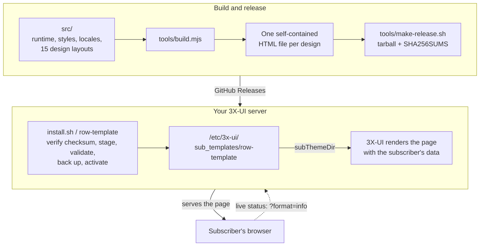

<!-- Сохраняйте идентичность разработчика, URL репозитория, команды, пути,
     номера версий и адреса кошельков в этом файле байт-в-байт идентичными
     переведённым файлам README. -->

<p align="center">
  
</p>

<p align="center">
  Аккуратная автономная страница подписки для панелей <a href="https://github.com/MHSanaei/3x-ui">3X-UI</a> — пятнадцать дизайнов, каждый в одном HTML-файле, полностью white-label и без сторонних запросов со страницы, которую открывают ваши подписчики.
</p>

<p align="center">
  <a href="README.md">English</a> | <a href="README.fa.md">فارسی</a> | <a href="README.ar.md">العربية</a> | <strong>Русский</strong> | <a href="README.zh-CN.md">简体中文</a>
</p>

<p align="center">
  <a href="LICENSE"></a>
  <a href="https://github.com/iitzSeriZdev/Row-Template/releases/latest"></a>
  
  
  <a href="https://iitzseridev.github.io/Row-Template/"></a>
</p>

<p align="center">
  <a href="#установка">Установка</a> ·
  <a href="#дизайны">Дизайны</a> ·
  <a href="https://iitzseridev.github.io/Row-Template/">Документация</a> ·
  <a href="CHANGELOG.md">Изменения</a> ·
  <a href="https://github.com/iitzSeriZdev/Row-Template/releases">Релизы</a>
</p>

---

## Что это такое

3X-UI умеет показывать подписчикам собственную страницу вместо встроенной. Row-Template — такая страница: подписчик открывает ссылку на подписку и видит свой тариф, расход трафика, дату окончания и способы добавить подписку в своё приложение в одно касание.

Каждый дизайн поставляется одним автономным HTML-файлом, в который встроены все стили, скрипты, шрифты и генератор QR-кодов. Одна команда устанавливает его рядом с панелью, направляет на него панель и даёт вам менеджер `row-template` для оформления, обновлений и отката.

## Почему Row-Template?

- **Приватность по умолчанию.** Страница, которую открывают подписчики, не делает сторонних запросов. QR-коды генерируются прямо на странице, а ваше оформление вставляется как текст — никогда не выполняется и никуда не отправляется.
- **Настоящий white-label.** Ваше название сервиса, ваша ссылка на поддержку, ваш логотип. Ничто на странице не указывает на Row-Template.
- **Пятнадцать дизайнов, каждый в одном файле.** Выберите вид, который подходит вашему сервису. У всех дизайнов одинаковые возможности, языки и проверки безопасности.
- **Сделано для ваших подписчиков.** Расход и срок действия в реальном времени, импорт в популярные приложения в одно касание и список отдельных конфигураций с поиском, чтобы добавить один сервер вручную.
- **Безопасен в эксплуатации.** Релизы с проверкой контрольной суммы, атомарная активация и откат одной командой. Row-Template никогда не патчит 3X-UI: единственная настройка панели, которую он меняет, — каталог страницы подписки (`subThemeDir`).

## Дизайны

Row-Template 1.2.0 поставляется с пятнадцатью дизайнами. Дизайн по умолчанию — Row.

<table>
  <tr>
    <td align="center"><br><sub>Row</sub></td>
    <td align="center"><br><sub>Editorial</sub></td>
    <td align="center"><br><sub>Canvas</sub></td>
    <td align="center"><br><sub>Prism</sub></td>
    <td align="center"><br><sub>Terminal</sub></td>
  </tr>
  <tr>
    <td align="center"><br><sub>Pulse</sub></td>
    <td align="center"><br><sub>Brutal</sub></td>
    <td align="center"><br><sub>Arcade</sub></td>
    <td align="center"><br><sub>Sketch</sub></td>
    <td align="center"><br><sub>Signature</sub></td>
  </tr>
  <tr>
    <td align="center"><br><sub>Saffron</sub></td>
    <td align="center"><br><sub>Pulse Nova</sub></td>
    <td align="center"><br><sub>Prism Nova</sub></td>
    <td align="center"><br><sub>Terminal Nova</sub></td>
    <td align="center"><br><sub>Arcade Nova</sub></td>
  </tr>
</table>

<sub>Превью построены на демонстрационных данных самого проекта. Превью каждого дизайна для компьютера и телефона — в <a href="https://iitzseridev.github.io/Row-Template/templates/">галерее шаблонов</a>.</sub>

Выберите дизайн при новой интерактивной установке, задайте `RT_TEMPLATE` для установки скриптом или смените его позже в менеджере (**Reconfigure branding → Template**). Обновления сохраняют ваш выбор.

## Возможности

**Для ваших подписчиков**

- **Статус в реальном времени.** Состояние тарифа, израсходованный и оставшийся трафик и срок действия, которые обновляются из вашей панели, пока страница открыта на экране.
- **Импорт в одно касание** в популярные приложения, сгруппированные по платформам: v2rayNG, Happ и sing-box на Android; Streisand, V2Box и Shadowrocket на iOS; Clash Verge Rev, Mihomo Party и v2rayN на Windows; Clash Verge Rev, Streisand и V2Box на macOS.
- **Копирование и QR.** Скопируйте ссылку на подписку или отсканируйте её как QR-код, созданный на самой странице.
- **Обозреватель конфигураций.** Каждый сервер в отдельной строке — с флагом страны или монограммой и меткой протокола (VLESS, VMess, Trojan, Shadowsocks, Hysteria/Hysteria2, WireGuard, AmneziaWG, Telegram MTProto), с QR-кодом и копированием для каждой конфигурации и поиском по длинным спискам.
- **Пять языков** — английский, персидский, арабский, русский и китайский — с раскладкой справа налево и выбором темы System / Light / Dark.

**Для вас**

- **White-label оформление.** Название сервиса, ссылка на поддержку и логотип — всё необязательно, хранится как данные и вставляется как текст.
- **Менеджер для всего.** Интерактивное меню и прямые команды для оформления, обновлений, проверки, отката и удаления.
- **Обновления из стабильного канала.** `row-template update` устанавливает новый стабильный релиз, только если он существует.

**Приватность и безопасность**

- **Никаких сторонних запросов** со страницы: без CDN, без внешних сервисов QR и геолокации, без телеметрии. Статус в реальном времени приходит из вашей же панели.
- **Обязательная проверка SHA-256** для каждой загрузки релиза, без возможности её пропустить.
- **Атомарная активация.** Новая страница создаётся и проверяется до того, как заменит работающую, поэтому неудачный шаг никогда не оставляет сломанную страницу.
- **Осторожное обнаружение панели.** Если найденная база данных панели не является корректной базой SQLite, Row-Template отказывается её использовать, а не пытается угадать другую.

## Поддерживаемые панели

| Панель | Статус | Примечания |
| ----- | ------ | ----- |
| [3X-UI](https://github.com/MHSanaei/3x-ui) (MHSanaei) | ✅ Поддерживается | Требуется версия **>= 3.6.0** |
| [PasarGuard](https://github.com/PasarGuard/panel) | 🔬 Исследование | Не поддерживается; установка не предусмотрена |
| [Rebecca](https://github.com/rebeccapanel/Rebecca) | 🔬 Исследование | Не поддерживается; установка не предусмотрена |

3X-UI — единственная поддерживаемая панель. PasarGuard и Rebecca используют другие шаблонизаторы (Jinja2 и pongo2); оболочка страницы каждого дизайна собирается для них и упаковывается в релиз для изучения, но установщик её не размещает, и инструкций по установке для них нет. Результаты исследования — в разделе [Совместимость](https://iitzseridev.github.io/Row-Template/compatibility/).

## Архитектура



- **Один файл на дизайн.** `tools/build.mjs` встраивает общий код, переводы, шрифты и генератор QR в макет дизайна и отклоняет макет, в котором нет хотя бы одной нужной коду точки привязки (hook). Затем `tools/verify.mjs` отклоняет файл, который загружает что-либо извне или содержит запрещённую конструкцию.
- **Страницу отрисовывает панель.** Страница — это шаблон: 3X-UI подставляет данные подписчика при выдаче, а затем страница обновляет свой статус из той же панели.
- **Установщик никогда не редактирует 3X-UI.** Он пишет в собственный каталог и меняет одну настройку панели, `subThemeDir`, чтобы она указывала на него.

| Путь | Содержимое |
| ---- | ---------------- |
| `src/` | Код, стили и переводы страницы; каждый дизайн — в `src/templates/<id>/` |
| `template/index.html` | Собранная страница Row, хранится в репозитории |
| `tools/` | Сборка, проверка, релизы и рендерер фикстур на Go |
| `installer/` | `install.sh`, команда `row-template` и её библиотека управления |
| `tests/` | Наборы тестов |
| `docs/` | Сайт документации; проектные записи — в [`docs/design/`](docs/design/README.md) |

## Установка

> **Рекомендуемая ОС: Ubuntu 24.04 LTS (x86_64).** Другие современные дистрибутивы Linux могут работать, но не проходили такого же объёма проверок.

**Требования:** сервер с 3X-UI **>= 3.6.0**, root-доступ к нему и `curl`, `tar` и `sha256sum` (есть практически в любой системе Linux). Для автоматической активации также нужен `sqlite3`.

Запустите от имени **root** на сервере, где работает ваша панель 3X-UI:

```bash
bash <(curl -fsSL https://github.com/iitzSeriZdev/Row-Template/releases/latest/download/install.sh)
```

Установщик:

1. Скачивает последний стабильный релиз с GitHub.
2. Проверяет его контрольную сумму SHA-256 (обязательно — без возможности обойти).
3. Безопасно распаковывает его и устанавливает в `/etc/3x-ui/sub_templates/row-template`.
4. При новой установке предлагает выбрать дизайн (Enter оставляет Row).
5. Запрашивает ваше оформление (название сервиса, ссылка на поддержку, логотип — всё необязательно).
6. Создаёт и проверяет страницу, а затем, если возможно, активирует её в панели.

Чтобы выбрать дизайн без меню выбора, например в скрипте:

```bash
RT_TEMPLATE=editorial bash <(curl -fsSL https://github.com/iitzSeriZdev/Row-Template/releases/latest/download/install.sh)
```

Если вы не хотите запускать скрипт прямо из сети, скачайте файлы релиза со [страницы релизов](https://github.com/iitzSeriZdev/Row-Template/releases/latest), проверьте контрольную сумму самостоятельно, как описано в [PROVENANCE.md](PROVENANCE.md), и запустите входящий в комплект `install.sh` из распакованного каталога.

### Активация

Row-Template устанавливается в каталог, который панель отдаёт как страницу подписки:

```
/etc/3x-ui/sub_templates/row-template
```

- **Автоматически:** если доступен `sqlite3`, Row-Template настраивает это за вас. Он ненадолго останавливает службу панели, записывает настройку, снова запускает службу и проверяет значение. Интерактивная установка сначала показывает текущее значение и спрашивает разрешения.
- **Вручную:** иначе откройте **Panel Settings → Subscription → Profile → Sub Theme Directory** и введите в точности:

  ```
  /etc/3x-ui/sub_templates/row-template
  ```

## Использование

Запустите менеджер без аргументов в терминале, чтобы открыть интерактивное меню:

```bash
row-template
```

Или используйте команду напрямую:

| Команда | Что делает |
| ------- | ------------ |
| `row-template config` | Меняет название сервиса, ссылку на поддержку или логотип и заново создаёт страницу |
| `row-template update` | Скачивает, проверяет и активирует новый стабильный релиз (проверка контрольной суммы обязательна) |
| `row-template rollback` | Восстанавливает предыдущую версию (`--auto` или `--to <backup>`) |
| `row-template verify` | Проверяет установку, связь с панелью и работающую страницу (от root также возвращает на место отсутствующие или перемещённые дизайны) |
| `row-template version` | Показывает установленную, минимально поддерживаемую и обнаруженную версии 3X-UI |
| `row-template uninstall` | Удаляет Row-Template и возвращает панели встроенную страницу |
| `row-template help` | Показывает справку |

Команды, изменяющие систему (`config`, `update`, `rollback`, `uninstall`), нужно запускать от имени root.

- **Оформление** хранится как данные, никогда не выполняется и вставляется в страницу как текст. Оставьте поле пустым, чтобы получить страницу без брендинга. Ссылка на поддержку принимает только схемы, которые браузер должен открывать, например `https://…`, `tg://…` или `mailto:…`.
- **Обновления** проверяют публичный стабильный канал и ничего не меняют, если более новой стабильной версии нет. Если источник релизов недоступен, `update` сообщает, что не смог проверить; установка при этом никогда не считается повреждённой.
- **Обновление с 1.1.0** выполняется одним запуском `row-template update`. Механизм обновления самой версии 1.1.0 копирует лишь часть нового релиза, поэтому следующий запуск `row-template`, `row-template config` или `row-template verify` от root сначала загружает остальную часть того же релиза — все дизайны, с проверкой контрольных сумм.
- **Откат** восстанавливает предыдущую версию из проверенной резервной копии. Сначала делается снимок (snapshot) текущей версии, поэтому неудачный откат можно исправить, а ваше оформление сохраняется.
- **Удаление** стирает файлы Row-Template. Настройку `subThemeDir` панели оно очищает, только если та указывает на Row-Template, и панель возвращается к встроенной странице; ваши inbound'ы, клиенты и сертификаты не затрагиваются.

[Документация](https://iitzseridev.github.io/Row-Template/) подробнее описывает настройку, оформление и устранение неполадок.

## Разработка

Страницы собираются из читаемых исходников в `src/`. Нужен Node.js 22 или новее, а для запуска тестов — Go 1.22 или новее.

```bash
npm run build          # regenerate template/index.html from src/
npm run verify         # check the built page against the safety gates
npm test               # render the fixture pages, then run every test suite
npm run fixtures:all   # render every design's fixture pages on their own
npm run lint:sh        # ShellCheck every shell script
npm run preview        # preview the fixture pages at http://127.0.0.1:8787
```

Сборка детерминирована — одни и те же исходники всегда дают побайтно идентичный `template/index.html`. Сайт документации — отдельное рабочее пространство в `docs/`; см. [docs/README.md](docs/README.md).

## Тестирование

- **`npm test`** сначала создаёт страницы фикстур всех дизайнов рендерером на Go, а затем запускает наборы тестов: скрипты страницы, сборку, итоговый файл каждого дизайна, содержимое релиза и установщик — его опубликованная shell-библиотека выполняется в настоящем `bash` на временных фикстурах.
- **`npm run verify`** проверяет собранную страницу по её правилам безопасности, в том числе: цельный документ, замена всех маркеров сборки, всё встроено, нет внешних ссылок, нет запрещённых конструкций, целые переводы и отсутствие невидимых символов в исходниках.
- **`npm run lint:sh`** завершается ошибкой при любой ошибке ShellCheck; `npm run lint:sh -- -S warning` показывает полный отчёт.
- **Workflow Docs** собирает сайт документации в каждом pull request, который его меняет.

## Дорожная карта

Направление, а не обещания:

- **Row-Template 1.2.0** — пятнадцать дизайнов и выбор дизайна, описанные выше.
- **PasarGuard и Rebecca** — исследование. Оболочки страниц для обеих собраны; для статуса в реальном времени нужно небольшое изменение в коде или обратный прокси (reverse proxy), и это решение отложено. См. [Совместимость](https://iitzseridev.github.io/Row-Template/compatibility/).
- **Установка на несколько панелей** — основа установщика (интерфейс панели, движок транзакций, адаптер 3X-UI и новый формат резервных копий) готова, но пока не используется ни одной командой.
- **Собственные шаблоны** — предложение о добавлении своего дизайна: [`docs/design/CUSTOM-TEMPLATES-PROPOSAL.md`](docs/design/CUSTOM-TEMPLATES-PROPOSAL.md).

## Участие в проекте

Сообщения об ошибках, переводы и исправления документации очень приветствуются. Прочитайте [CONTRIBUTING.md](CONTRIBUTING.md), прежде чем открывать pull request, и соблюдайте [Кодекс поведения](CODE_OF_CONDUCT.md).

**Сообщения об ошибках:** создайте issue на <https://github.com/iitzSeriZdev/Row-Template/issues>. Укажите версию Row-Template (`row-template version`), версию 3X-UI, операционную систему и её версию, архитектуру процессора, вывод `row-template verify` и чёткие шаги для воспроизведения.

> **Не указывайте секретные данные.** Никогда не вставляйте URL подписок, значения `subId`, UUID клиентов, имена пользователей и пароли панели, cookie, токены, панельный `webBasePath`, ключи TLS или реальные адреса серверов. Скрывайте конфиденциальные данные в логах перед тем, как ими делиться.

## Безопасность

Нашли уязвимость? Пожалуйста, сообщите о ней приватно — см. [SECURITY.md](SECURITY.md). Не создавайте публичный issue по проблемам безопасности. [PROVENANCE.md](PROVENANCE.md) объясняет, как собираются релизы и как их проверить.

## Поддержать проект

Row-Template — бесплатный проект с открытым исходным кодом. Если он экономит вам время, вы можете поддержать его развитие:

- **USDT (BEP20 / BNB Smart Chain):**

  ```
  0x2606551375987cec71F5fC033968B638A7a4bae4
  ```

- **TRON:**

  ```
  TYD5RFfiYrcETzWNSkAhfwgmRu1wQBbs6W
  ```

- **NOWPayments:** <https://nowpayments.io/donation/iitzSeriZ>

Спасибо.

## Лицензия

Распространяется под [лицензией MIT](LICENSE). Входящий в комплект генератор QR-кодов (`src/vendor/uqr`) включён под собственной лицензией MIT, а встроенное подмножество шрифта Vazirmatn — под лицензией SIL Open Font License (`src/fonts/OFL.txt`).

## Разработчик

Создано и поддерживается **iitzSeriZdev** — <https://github.com/iitzSeriZdev/Row-Template>
