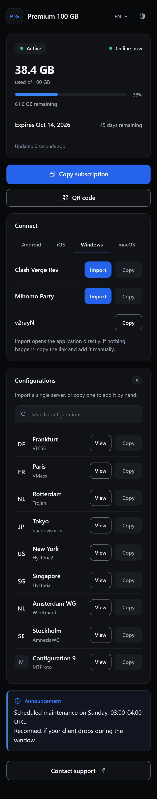
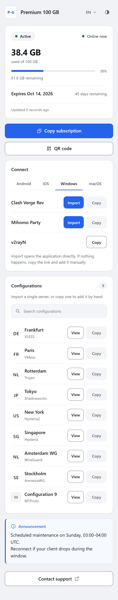

<!-- 请保持本文件中的开发者标识、仓库 URL、命令、路径、版本号以及钱包地址
     与各翻译版 README 逐字节完全一致。 -->

<p align="center">
  
</p>

<p align="center">
  为 <a href="https://github.com/MHSanaei/3x-ui">3X-UI</a> 面板打造的精致、自包含的自定义订阅页面——单个 HTML 文件，完全支持白标，不依赖任何第三方 CDN，订阅用户打开的页面也不会发起任何外部请求。
</p>

<p align="center">
  <a href="README.md">English</a> | <a href="README.fa.md">فارسی</a> | <a href="README.ar.md">العربية</a> | <a href="README.ru.md">Русский</a> | <strong>简体中文</strong>
</p>

<p align="center">
  <a href="LICENSE"></a>
  <a href="https://github.com/iitzSeriZdev/Row-Template/releases/latest"></a>
  
  
</p>

---

## 为什么选择 Row-Template？

- **设计即隐私。** 订阅用户打开的页面不会发起任何第三方请求。二维码在本地生成，你的品牌信息以文本形式注入——绝不会被执行，也绝不会被发送到任何地方。
- **真正的白标。** 你自己的服务名称、支持链接和 Logo。对外服务的页面上不会有任何标识 Row-Template 的内容。
- **单个文件，无运行时依赖。** CSS、JavaScript、字体和二维码生成器都内联到单个 HTML 文件中，仅凭标准的 Linux 用户空间工具即可安装——无需 Node.js、Python 或数据库。
- **为你的订阅用户而设计。** 实时用量与到期时间、一键导入到常用应用，以及可搜索的单条配置列表，便于手动添加单个服务器。
- **运行安全。** 原子化安装，带校验与一条命令回滚。绝不修补 3X-UI，也绝不触及面板文件。

## 界面截图

<table>
  <tr>
    <td width="50%"></td>
    <td width="50%"></td>
  </tr>
  <tr>
    <td align="center"><sub>深色主题</sub></td>
    <td align="center"><sub>浅色主题</sub></td>
  </tr>
</table>

<sub>截图使用示例数据；所示的配置列表与国家/地区标识仅为示例。</sub>

## 快速安装

> **推荐操作系统：Ubuntu 24.04 LTS (x86_64)。** 其他较新的 Linux 发行版或许也能运行，但未经过同等程度的验证覆盖。

在托管 3X-UI 面板的服务器上以 **root** 身份运行：

```bash
bash <(curl -fsSL https://github.com/iitzSeriZdev/Row-Template/releases/latest/download/install.sh)
```

安装程序会下载最新的稳定版本，校验其 SHA-256 校验和（没有跳过选项），安全地解压，并引导你完成品牌定制。它绝不会修补 3X-UI，也绝不会改动面板自身的任何文件。

## 支持的面板

| 面板 | 状态 | 说明 |
| ----- | ------ | ----- |
| [3X-UI](https://github.com/MHSanaei/3x-ui) (MHSanaei) | ✅ 已支持 | 需要版本 **>= 3.6.0** |
| [Marzban](https://github.com/Gozargah/Marzban) | ⬜ 计划中 | 暂不支持 |
| [Marzneshin](https://github.com/marzneshin/marzneshin) | ⬜ 计划中 | 暂不支持 |
| [Rebecca](https://github.com/rebeccapanel/Rebecca) | ⬜ 计划中 | 暂不支持 |
| [PasarGuard](https://github.com/PasarGuard/panel) | ⬜ 计划中 | 暂不支持 |

目前仅支持 3X-UI。其他面板已列入路线图，在此列出是为了保持透明——本版本中不存在对它们的任何部分支持或实验性支持。

## 功能特性

- **单一自包含页面。** 所有 CSS、JavaScript、字体以及二维码生成器都内联到了单个 HTML 文件中。订阅用户打开的页面不会发起任何第三方请求。
- **白标定制。** 设置你自己的服务名称、支持链接和 Logo。对外服务的页面上不会有任何标识 Row-Template 的内容。
- **五种语言。** 英语、波斯语、阿拉伯语、俄语和中文，并支持从右到左的布局。
- **设计即安全。** 你的品牌信息被当作数据处理并以文本形式注入，绝不会被执行。页面绝不会将订阅用户的数据发送到任何地方。
- **实时用量视图。** 显示套餐状态、已用与剩余流量、到期时间，以及带有复制按钮和二维码的各客户端链接。
- **原子化的安装与回滚。** 每次变更都会先暂存、校验，再切换生效。失败的步骤绝不会让损坏的页面上线，你也可以回滚到先前的版本。
- **无运行时依赖。** 仅需标准的 Linux 用户空间工具（bash、coreutils、curl、tar、sha256sum）。安装或运行它无需 Node.js、Python 或任何数据库。

## 环境要求

- 一台运行 3X-UI 面板的服务器（版本 **>= 3.6.0**）。
- 对该服务器的 root 访问权限。
- `curl`、`tar` 和 `sha256sum`（几乎所有 Linux 系统都自带）。

## 兼容性

- **面板：** 3X-UI (MHSanaei) **>= 3.6.0**。已针对原版 3.7.0 完成验证。
- **操作系统：** 推荐 Ubuntu 24.04 LTS。已在 Ubuntu 24.04 LTS (x86_64) 上验证。其他发行版或许也能运行，但未获得同等程度的验证覆盖。

## 安装

以 root 身份运行上方展示的安装命令。安装程序将会：

1. 从 GitHub 下载最新的稳定版本。
2. 校验版本的校验和（SHA-256，强制执行——无法绕过）。
3. 安全地解压，并安装到 `/etc/3x-ui/sub_templates/row-template`。
4. 提示你输入品牌信息（服务名称、支持链接、Logo——均为可选）。
5. 生成对外服务的页面，并在可能的情况下于面板中激活它。

如果你不希望直接从网络管道执行，可以从 [Releases page](https://github.com/iitzSeriZdev/Row-Template/releases/latest) 下载版本资源文件，自行校验校验和，然后在解压后的目录中运行随附的 `install.sh`。

## 管理器

安装完成后，可使用 `row-template` 命令管理一切。在终端中不带参数运行它即可打开交互式管理器：

```bash
row-template
```

或者使用以下直接命令：

| 命令 | 作用 |
| ------- | ------------ |
| `row-template config` | 重新配置品牌信息（服务名称、支持链接、Logo） |
| `row-template update` | 检查稳定版通道，若存在更新的版本则进行更新 |
| `row-template rollback` | 回滚到先前的版本（`--auto` 或 `--to <backup>`） |
| `row-template verify` | 检查安装是否健康 |
| `row-template version` | 打印已安装的版本 |
| `row-template uninstall` | 移除 Row-Template（不影响 3X-UI） |
| `row-template help` | 显示用法 |

## 品牌与配置

在安装期间设置你的服务名称、支持链接和 Logo，也可以随时更改它们：

```bash
row-template config
```

你输入的内容会作为数据存储（绝不会被执行），并以文本形式注入到页面中。将某个字段留空即可得到一个无品牌的白标页面。支持链接仅接受浏览器应当打开的协议方案（例如 `https://…`、`tg://…` 或 `mailto:…`）。

## 激活

Row-Template 会安装到面板用作订阅页面的目录：

```
/etc/3x-ui/sub_templates/row-template
```

- **自动：** 当 `sqlite3` 可用时，安装程序/管理器可以为你将面板指向 Row-Template。
- **手动：** 否则，请自行在面板中设置——打开 **面板设置 → 订阅 → 配置文件 → 订阅主题目录**，并准确输入：

  ```
  /etc/3x-ui/sub_templates/row-template
  ```

## 更新

```bash
row-template update
```

此命令会检查公共稳定版发布通道，显示已安装版本与可用版本，并且仅在存在更新的稳定版本时才进行更新。如果网络或发布源无法访问，它会报告无法完成检查——你的安装绝不会被视为已损坏。日常使用无需任何 URL 或手动下载。

## 回滚

```bash
row-template rollback
```

从经过校验的备份中恢复先前的版本。当前版本会先被快照保存，因此即便回滚失败也可恢复。你的品牌配置会被保留。

## 验证

```bash
row-template verify
```

报告已安装的产物、面板接线以及服务是否健康。

## 卸载

```bash
row-template uninstall
```

移除 Row-Template 及其文件。它 **不会** 触及 3X-UI、其数据库、你的入站、客户端或证书。

## 语言

订阅页面提供五种界面语言，并会遵循订阅用户的面板/浏览器区域设置：

**English · فارسی · العربية · Русский · 简体中文**

阿拉伯语和波斯语以从右到左的方式呈现。

## 问题反馈

请提交一个 issue：<https://github.com/iitzSeriZdev/Row-Template/issues>

请附上你的 Row-Template 版本（`row-template version`）、3X-UI 版本、操作系统及其版本、CPU 架构、`row-template verify` 的输出，以及清晰的复现步骤。

> **请勿包含机密信息。** 切勿粘贴订阅 URL、`subId` 值、客户端 UUID、面板用户名或密码、Cookie、令牌、面板的 `webBasePath`、TLS 密钥或真实的服务器地址。分享日志前请先对其做脱敏处理。

## 安全

发现了漏洞？请私下报告——参见 [SECURITY.md](SECURITY.md)。请勿为安全问题创建公开的 issue。

## 开发

这个单文件产物由 `src/` 中可读的源码构建而成：

```bash
npm run build     # regenerate template/index.html from src/
npm run verify    # check the artifact against the safety gates
npm test          # run the unit and installer test suites
```

该构建是确定性的——相同的源码总是生成逐字节相同的 `template/index.html`。参见 [CONTRIBUTING.md](CONTRIBUTING.md)。

## 支持本项目

Row-Template 是免费且开源的。如果它为你节省了时间，欢迎支持它的开发：

- **USDT（BEP20 / BNB Smart Chain）：**

  ```
  0x2606551375987cec71F5fC033968B638A7a4bae4
  ```

- **TRON：**

  ```
  TYD5RFfiYrcETzWNSkAhfwgmRu1wQBbs6W
  ```

- **NOWPayments：** <https://nowpayments.io/donation/iitzSeriZ>

谢谢。

## 许可证

基于 [MIT License](LICENSE) 发布。随附的二维码生成器（`src/vendor/uqr`）依据其自身的 MIT 许可证包含在内。

## 开发者

由 **iitzSeriZdev** 构建和维护 —— <https://github.com/iitzSeriZdev/Row-Template>
