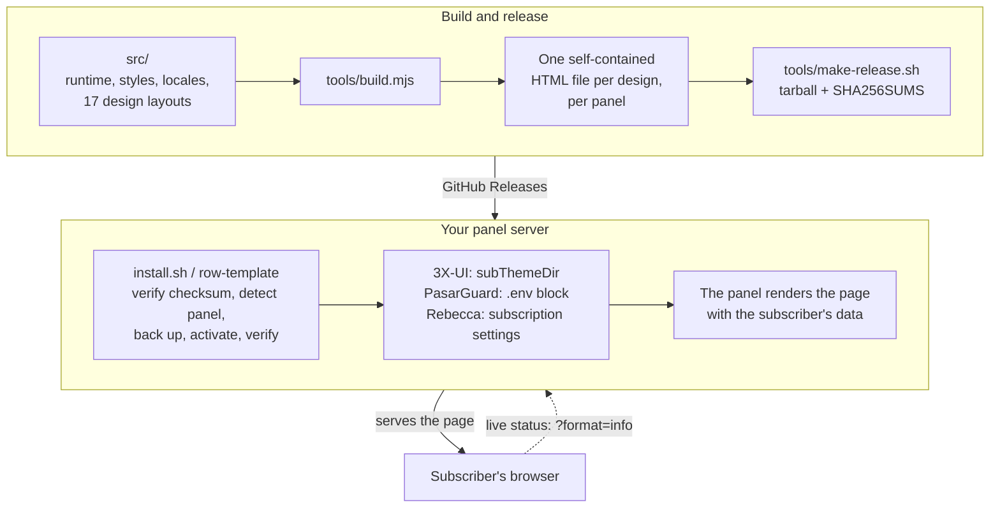

<!-- 请保持本文件中的开发者标识、仓库 URL、命令、路径、版本号以及钱包地址
     与各翻译版 README 逐字节完全一致。 -->

<p align="center">
  
</p>

<p align="center">
  为 <a href="https://github.com/MHSanaei/3x-ui">3X-UI</a>、<a href="https://github.com/PasarGuard/panel">PasarGuard</a> 和 <a href="https://github.com/rebeccapanel/Rebecca">Rebecca</a> 面板打造的精致、自包含的订阅页面 —— 十七种设计，每种都是一个 HTML 文件，完全白标（white-label），订阅者打开的页面不会向任何第三方发出请求。
</p>

<p align="center">
  <a href="README.md">English</a> | <a href="README.fa.md">فارسی</a> | <a href="README.ar.md">العربية</a> | <a href="README.ru.md">Русский</a> | <strong>简体中文</strong>
</p>

<p align="center">
  <a href="LICENSE"></a>
  <a href="https://github.com/iitzSeriZdev/Row-Template/releases/latest"></a>
  
  
  <a href="https://iitzseridev.github.io/Row-Template/"></a>
</p>

<p align="center">
  <a href="#安装">安装</a> ·
  <a href="#设计">设计</a> ·
  <a href="https://iitzseridev.github.io/Row-Template/">文档</a> ·
  <a href="CHANGELOG.md">更新日志</a> ·
  <a href="https://github.com/iitzSeriZdev/Row-Template/releases">发布</a>
</p>

---

## 这是什么

3X-UI、PasarGuard 和 Rebecca 都可以向订阅者展示自定义页面来代替内置页面。Row-Template 就是这样一个页面：订阅者打开订阅链接，就能看到自己的套餐、用量和到期日期，以及一键把订阅添加到所用应用的方式。

每种设计都以一个自包含的 HTML 文件提供，所有样式、脚本、字体和二维码生成器都已内联其中，并为每个面板提供一个使用该面板自身模板语言的版本。一条命令即可检测你的面板、把页面安装到面板旁边、让面板指向它，并为你提供 `row-template` 管理器，用于品牌设置、更新和回滚。

## 为什么选择 Row-Template？

- **隐私优先。** 订阅者打开的页面不会向任何第三方发出请求。二维码在页面内生成，你的品牌信息以文本形式注入 —— 从不执行，也从不发送到任何地方。
- **真正的白标。** 你的服务名称、你的支持链接、你的徽标。所呈现的页面上没有任何内容标明 Row-Template。
- **十七种设计，每种一个文件。** 选择适合你服务的外观。所有设计在每个受支持的面板上都共享相同的功能、语言和安全检查。
- **为你的订阅者而设计。** 实时显示用量和到期时间，一键导入常用应用，以及可搜索的单独配置列表，便于手动添加单个服务器。
- **运维安全。** 经校验和验证的发布、任何一步失败都会把面板精确恢复原状的事务式激活，以及一条命令即可回滚。它从不修补你的面板：在 3X-UI 上只修改一项设置（`subThemeDir`），在 PasarGuard 上向 `.env` 追加一个带标记的块，在 Rebecca 上设置订阅设置中的两个字段。

## 设计

Row-Template 1.3.0 提供十七种设计，默认设计为 Row。

<table>
  <tr>
    <td align="center"><br><sub>Row</sub></td>
    <td align="center"><br><sub>Editorial</sub></td>
    <td align="center"><br><sub>Canvas</sub></td>
    <td align="center"><br><sub>Prism</sub></td>
    <td align="center"><br><sub>Terminal</sub></td>
  </tr>
  <tr>
    <td align="center"><br><sub>Pulse</sub></td>
    <td align="center"><br><sub>Brutal</sub></td>
    <td align="center"><br><sub>Arcade</sub></td>
    <td align="center"><br><sub>Sketch</sub></td>
    <td align="center"><br><sub>Signature</sub></td>
  </tr>
  <tr>
    <td align="center"><br><sub>Saffron</sub></td>
    <td align="center"><br><sub>Pulse Nova</sub></td>
    <td align="center"><br><sub>Prism Nova</sub></td>
    <td align="center"><br><sub>Terminal Nova</sub></td>
    <td align="center"><br><sub>Arcade Nova</sub></td>
  </tr>
  <tr>
    <td align="center"><br><sub>Meter</sub></td>
    <td align="center"><br><sub>Notebook</sub></td>
  </tr>
</table>

<sub>预览图使用项目自带的示例数据渲染。每种设计的桌面端和移动端预览见<a href="https://iitzseridev.github.io/Row-Template/templates/">模板画廊</a>。</sub>

可以在全新的交互式安装时选择设计，在脚本安装时设置 `RT_TEMPLATE`，或之后在管理器中更改（**Reconfigure branding → Template**）。更新会保留你的选择。

## 功能特性

**面向你的订阅者**

- **实时状态。** 套餐状态、已用和剩余流量以及到期时间，在页面可见期间从你的面板刷新（3X-UI；在 PasarGuard 和 Rebecca 上，页面显示打开时的数值）。
- **一键导入**常用应用，按平台分组：Android 上的 v2rayNG、Happ 和 sing-box；iOS 上的 Streisand、V2Box 和 Shadowrocket；Windows 上的 Clash Verge Rev、Mihomo Party 和 v2rayN；macOS 上的 Clash Verge Rev、Streisand 和 V2Box。
- **复制与二维码。** 复制订阅链接，或扫描在页面内生成的二维码。
- **配置浏览器。** 每个服务器单独一行，带有国家旗帜或首字母徽章（monogram）以及协议标签（VLESS、VMess、Trojan、Shadowsocks、Hysteria/Hysteria2、WireGuard、AmneziaWG、Telegram MTProto），每个配置都可查看二维码和复制，长列表支持搜索。
- **五种语言** —— 英语、波斯语、阿拉伯语、俄语和中文 —— 支持从右到左的布局，并可选择 System / Light / Dark 主题。

**面向你**

- **白标品牌。** 服务名称、支持链接和徽标，均为可选，以数据形式存储并以文本形式注入。
- **一个管理器搞定一切。** 交互式菜单和直接命令，用于品牌设置、更新、验证、回滚和卸载。
- **稳定通道更新。** 每次运行 `row-template update` 都会安装经过校验的最新稳定版本——因此它也是快速修复安装的方法。

**隐私与安全**

- 所呈现的页面**不向第三方发出任何请求**：没有 CDN，没有外部二维码或地理定位服务，没有遥测。实时状态来自你自己的面板。
- 每次下载发布版本都**强制进行 SHA-256 校验**，且没有跳过的选项。
- **原子化激活。** 新页面在替换当前页面之前先生成并通过验证，因此失败的步骤绝不会让损坏的页面上线。
- **谨慎的面板检测。** 只有在多个独立迹象一致时才认为面板已安装；只安装了一半的面板，或不是有效 SQLite 数据库的面板数据库，都会被拒绝，而不是去猜测。

## 支持的面板

| 面板 | 状态 | 说明 |
| ----- | ------ | ----- |
| [3X-UI](https://github.com/MHSanaei/3x-ui) (MHSanaei) | ✅ 已支持 | 需要 **>= 3.6.0** 版本 |
| [PasarGuard](https://github.com/PasarGuard/panel) | ✅ 自 1.3.0 起支持 | 官方 Docker 安装或源码安装（`pasarguard.service`） |
| [Rebecca](https://github.com/rebeccapanel/Rebecca) | ✅ 自 1.3.0 起支持 | 使用 SQLite 和 `sqlite3` 时自动激活；使用 MySQL/MariaDB 时需在控制台中填写一项设置 |

三个面板使用三种不同的模板引擎 —— Go `html/template`、Jinja2 和 pongo2 —— 因此每种设计都会为每个面板分别构建，并用该面板真实的引擎渲染来测试每个版本。安装程序会检测服务器上是哪一个面板；如果有多个，它会询问你（或读取 `RT_PANEL`）。**支持**意味着该面板具备全部七项能力 —— 检测、安装、激活、校验、备份、还原和卸载 —— 并且每一项都由测试套件覆盖。各面板的详细信息见[兼容性](https://iitzseridev.github.io/Row-Template/compatibility/)。

## 架构



- **每种设计一个文件。** `tools/build.mjs` 将共享的运行时代码、翻译、字体和二维码生成器内联到设计的布局中，并拒绝缺少任何运行时所需钩子（hook）的布局。随后 `tools/verify.mjs` 会拒绝任何加载远程资源或包含禁用结构的文件。
- **由面板负责渲染。** 页面是一个模板：面板在提供页面时填入订阅者的数据。对于 PasarGuard（Jinja2）和 Rebecca（pongo2），每种设计都包在一段小的前导代码中，它把面板自身的数据映射到页面字段并对每个值进行转义。
- **安装程序从不修补你的面板。** 在 3X-UI 上，它让 `subThemeDir` 指向自己的目录；在 PasarGuard 上，它把页面放入模板目录，并向 `.env` 追加一个带标记的块；在 Rebecca 上，它放置页面并设置订阅设置中的页面和目录字段。每次修改前都会先做快照，任何一步失败都会精确恢复。

| 路径 | 内容 |
| ---- | ---------------- |
| `src/` | 页面的运行时代码、样式和翻译；每种设计位于 `src/templates/<id>/` |
| `template/index.html` | 构建好的 Row 页面，已提交到仓库 |
| `tools/` | 构建、验证、发布以及 Go 编写的 fixture 渲染器 |
| `installer/` | `install.sh`、`row-template` 命令、其管理库，以及 `installer/panels/` 中每个面板各一个的适配器 |
| `tests/` | 测试套件 |
| `docs/` | 文档站点；设计记录位于 [`docs/design/`](docs/design/README.md) |

## 安装

> **推荐操作系统：Ubuntu 24.04 LTS (x86_64)。** 其他较新的 Linux 发行版或许也能运行，但未经过同等程度的验证覆盖。

**环境要求：** 运行 3X-UI **>= 3.6.0**、PasarGuard 或 Rebecca 的服务器；该服务器的 root 权限；以及 `curl`、`tar` 和 `sha256sum`（几乎所有 Linux 系统都自带）。在 3X-UI 和 Rebecca 上自动激活还需要 `sqlite3`。

在托管你的面板的服务器上以 **root** 身份运行：

```bash
bash <(curl -fsSL https://github.com/iitzSeriZdev/Row-Template/releases/latest/download/install.sh)
```

安装程序会：

1. 从 GitHub 下载最新的稳定版本。
2. 校验其 SHA-256 校验和（强制 —— 无法绕过）。
3. 检测你的面板，安全地解压发布包并安装到 `/etc/3x-ui/sub_templates/row-template`（3X-UI）或 `/etc/row-template`（PasarGuard、Rebecca）。
4. 全新安装时显示设计选择器（按 Enter 保留 Row）。
5. 提示你设置品牌信息（服务名称、支持链接、徽标 —— 均为可选）。
6. 生成并验证页面，然后在可能的情况下在面板中激活它。

如需不经选择器直接选定设计（例如在脚本中）：

```bash
RT_TEMPLATE=editorial bash <(curl -fsSL https://github.com/iitzSeriZdev/Row-Template/releases/latest/download/install.sh)
```

在运行多个受支持面板的服务器上，安装程序会询问要为哪一个提供页面；在脚本中，可用 `RT_PANEL`（`3xui`、`pasarguard` 或 `rebecca`）指定：

```bash
RT_PANEL=pasarguard bash <(curl -fsSL https://github.com/iitzSeriZdev/Row-Template/releases/latest/download/install.sh)
```

如果你不希望直接从网络通过管道执行，可以从 [Releases 页面](https://github.com/iitzSeriZdev/Row-Template/releases/latest)将四个发布文件（`install.sh`、`manifest.txt`、`SHA256SUMS` 和 `row-template-<version>.tar.gz`）下载到同一个文件夹，按照 [PROVENANCE.md](PROVENANCE.md) 中的说明自行校验校验和，然后让安装程序使用该文件夹：

```bash
RT_RELEASE_DIR=/root/row-template-release bash /root/row-template-release/install.sh
```

### 激活

交互式安装会先说明激活将修改什么，并征求你的同意。在 PasarGuard 和 Rebecca 上，激活以事务方式进行：先为面板状态做快照，再应用并验证修改；任何一步失败，面板都会被精确恢复。

**3X-UI。** Row-Template 安装在一个由面板作为订阅页面提供的目录中：

```
/etc/3x-ui/sub_templates/row-template
```

- **自动：** 当 `sqlite3` 可用时，Row-Template 会替你完成设置。它会短暂停止面板服务、写入设置、重新启动服务并核对该值。
- **手动：** 否则，请打开 **Panel Settings → Subscription → Profile → Sub Theme Directory** 并准确输入：

  ```
  /etc/3x-ui/sub_templates/row-template
  ```

**PasarGuard。** 页面放在 `/var/lib/pasarguard/templates/row-template/index.html`（如果你设置了自己的 `CUSTOM_TEMPLATES_DIRECTORY`，则放在其中），并向 `/opt/pasarguard/.env` 追加一个带标记的块：

```
# >>> row-template (managed by Row-Template; do not edit) nl=0 >>>
CUSTOM_TEMPLATES_DIRECTORY = "/var/lib/pasarguard/templates"
SUBSCRIPTION_PAGE_TEMPLATE = "row-template/index.html"
# <<< row-template <<<
```

PasarGuard 在启动时读取 `.env`，因此正在运行的面板会重启一次。你自己的任何一行都不会被修改；卸载会删除该块，并把 `.env` 精确恢复为之前的字节。拥有自己订阅模板的管理员，或 **disable subscription template** 设置，仍然优先 —— 如果其中之一生效，`row-template verify` 会告诉你。

**Rebecca。** 页面放在 `/var/lib/rebecca/templates/row-template/index.html`（或你自己的自定义模板目录中），并把 Rebecca 的订阅设置设为 `row-template/index.html`。Rebecca 在每次请求时读取这些设置，因此无需重启。

- **自动：** 使用默认的 SQLite 数据库并已安装 `sqlite3` 时。
- **手动：** 使用 MySQL/MariaDB（或没有 `sqlite3`）时：页面仍会放好；在 Rebecca 控制台中打开 **Settings → Subscription → Templates**，把 **Subscription page template** 设为 `row-template/index.html`，把 **Custom templates directory** 设为 `/var/lib/rebecca/templates`。

## 使用

在终端中不带参数运行管理器以打开交互式菜单：

```bash
row-template
```

或直接使用命令：

| 命令 | 作用 |
| ------- | ------------ |
| `row-template config` | 更改服务名称、支持链接或徽标，然后重新生成页面 |
| `row-template update` | 下载、校验并激活最新的稳定版本（强制校验校验和） |
| `row-template rollback` | 恢复到之前的版本（`--auto` 或 `--to <backup>`） |
| `row-template verify` | 检查安装、面板连接和当前页面（以 root 运行时还会补回缺失或放错位置的设计） |
| `row-template version` | 显示已安装版本及其服务的面板（在 3X-UI 上还显示最低支持版本和检测到的版本） |
| `row-template uninstall` | 移除 Row-Template 并让面板恢复之前使用的页面 |
| `row-template help` | 显示用法 |

会修改系统的命令（`config`、`update`、`rollback`、`uninstall`）必须以 root 身份运行。

- **品牌信息**以数据形式存储，从不执行，并以文本形式注入页面。将某个字段留空即可得到无品牌的页面。支持链接只接受浏览器应当打开的协议，例如 `https://…`、`tg://…` 或 `mailto:…`。
- **更新**来自公共稳定通道。`row-template update` 总是应用最新的稳定版本，即使你已安装的就是该版本；管理器中的 **Update** 会先比较版本，并在做出任何更改前询问。如果无法访问发布源，则不会做任何更改，你的安装也绝不会因此被视为已损坏。
- **从 1.1.0 或 1.2.x 更新**只需运行一次 `row-template update`。1.1.0 自带的更新程序只会复制新版本的一部分，因此下一次以 root 运行 `row-template`、`row-template config` 或 `row-template verify` 时，会先下载同一版本的其余部分——所有设计，并校验 checksum。你的设计、品牌配置和面板连接都会保留。
- **回滚**会从经过验证的备份中恢复之前的版本。系统会先为当前版本创建快照（snapshot），因此失败的回滚也可以恢复，且你的品牌配置会被保留。备份会记录其所在的面板，绝不会恢复到另一个面板上；来自旧版本、未记录设计名称的备份会按 Row 恢复。
- **卸载**会移除 Row-Template 的文件，并让面板恢复之前使用的页面：在 3X-UI 上，只有当 `subThemeDir` 指向 Row-Template 时才会将其清除；在 PasarGuard 上，删除它在 `.env` 中的块和它的页面；在 Rebecca 上，恢复它修改过的两项订阅设置（如果你此后已选择了其他页面，则不做改动）。你的用户、入站（inbound）、客户端、节点和证书都不会受到影响。

[文档](https://iitzseridev.github.io/Row-Template/)更详细地介绍了配置、品牌设置和故障排查。

## 开发

页面由 `src/` 中可读的源代码构建而成。你需要 Node.js 22 或更高版本；运行测试还需要 Go 1.22 或更高版本，以及带 Jinja2 的 Python 3（`pip install jinja2`），它们用这两个面板真实的引擎渲染 PasarGuard 和 Rebecca 页面。

```bash
npm run build          # regenerate template/index.html from src/
npm run verify         # check the built page against the safety gates
npm test               # render the fixture pages, then run every test suite
npm run fixtures:all   # render every design's fixture pages on their own
npm run lint:sh        # ShellCheck every shell script
npm run preview        # preview the fixture pages at http://127.0.0.1:8787
```

构建是确定性的 —— 相同的源代码总会生成逐字节一致的 `template/index.html`。文档站点是 `docs/` 中的独立工作区；参见 [docs/README.md](docs/README.md)。

## 测试

- **`npm test`** 先用 Go 渲染器生成所有设计的 fixture 页面，然后运行各测试套件：页面脚本、构建、每种设计的最终文件、由真实 Jinja2 和 pongo2 渲染的 PasarGuard 和 Rebecca 页面（包括恶意和畸形数据）、发布包内容以及安装程序 —— 其发布的 shell 库和每个面板的适配器会在真实的 `bash` 中，针对按各面板官方安装方式布置的临时主机运行。
- **`npm run verify`** 按照安全关卡检查构建好的页面，包括：完整的文档、所有构建标记均已替换、所有内容均已内联、没有远程引用、没有禁用结构、翻译完整，以及源代码中没有不可见字符。
- **`npm run lint:sh`** 遇到任何 ShellCheck 错误即失败；`npm run lint:sh -- -S warning` 会显示完整报告。
- **Docs 工作流**会在每个修改文档站点的 pull request 中构建该站点。

## 路线图

这是方向，而非承诺：

- **Row-Template 1.3.0** —— 上文介绍的 PasarGuard 和 Rebecca 支持，以及 Meter 和 Notebook 设计。
- **PasarGuard 和 Rebecca 上的实时状态** —— 两者都通过路径后缀而不是 `?format=info` 提供它；接入需要对运行时代码做一处小改动，这一决定已推迟。参见[兼容性](https://iitzseridev.github.io/Row-Template/compatibility/)。
- **自定义模板** —— 关于添加你自己设计的提案：[`docs/design/CUSTOM-TEMPLATES-PROPOSAL.md`](docs/design/CUSTOM-TEMPLATES-PROPOSAL.md)。

## 参与贡献

非常欢迎问题反馈、翻译和文档修正。在提交 pull request 之前请阅读 [CONTRIBUTING.md](CONTRIBUTING.md)，并遵守[行为准则](CODE_OF_CONDUCT.md)。

**问题反馈：** 请在 <https://github.com/iitzSeriZdev/Row-Template/issues> 提交 issue。请附上你的 Row-Template 版本（`row-template version`）、你的面板及其版本、操作系统及其版本、CPU 架构、`row-template verify` 的输出，以及清晰的复现步骤。

> **请勿包含机密信息。** 切勿粘贴订阅 URL、`subId` 值、客户端 UUID、面板用户名或密码、Cookie、令牌、面板的 `webBasePath`、`.env` 的内容、数据库 URL、TLS 密钥或真实的服务器地址。分享日志前请先对其做脱敏处理。

## 安全

发现了漏洞？请私下报告——参见 [SECURITY.md](SECURITY.md)。请勿为安全问题创建公开的 issue。[PROVENANCE.md](PROVENANCE.md) 说明了发布版本是如何构建的以及如何验证它们。

## 支持本项目

Row-Template 是免费且开源的。如果它为你节省了时间，欢迎支持它的开发：

- **USDT（BEP20 / BNB Smart Chain）：**

  ```
  0x2606551375987cec71F5fC033968B638A7a4bae4
  ```

- **TRON：**

  ```
  TYD5RFfiYrcETzWNSkAhfwgmRu1wQBbs6W
  ```

- **NOWPayments：** <https://nowpayments.io/donation/iitzSeriZ>

谢谢。

## 许可证

基于 [MIT License](LICENSE) 发布。随附的二维码生成器（`src/vendor/uqr`）依据其自身的 MIT 许可证包含在内，内嵌的 Vazirmatn 字体子集则依据 SIL Open Font License（`src/fonts/OFL.txt`）提供。

## 开发者

由 **iitzSeriZdev** 构建和维护 —— <https://github.com/iitzSeriZdev/Row-Template>
